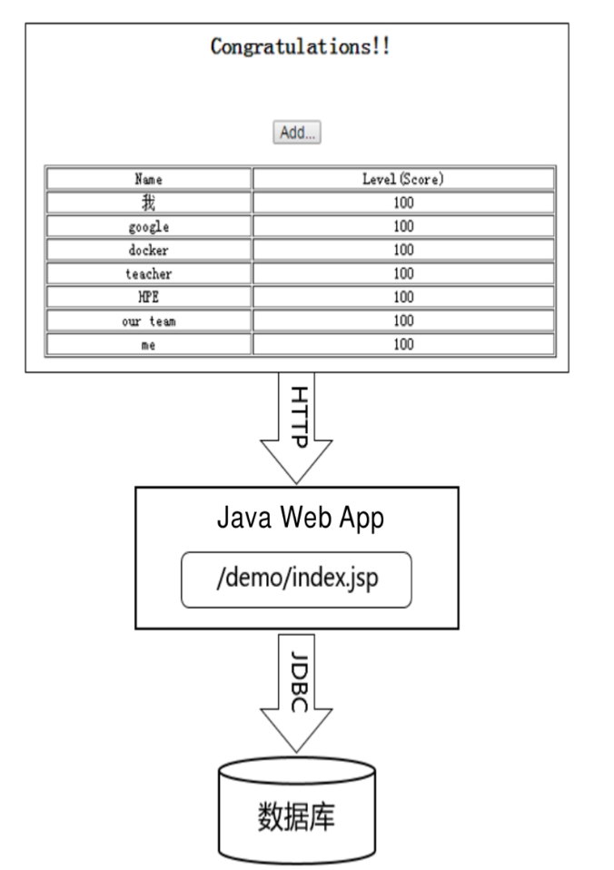
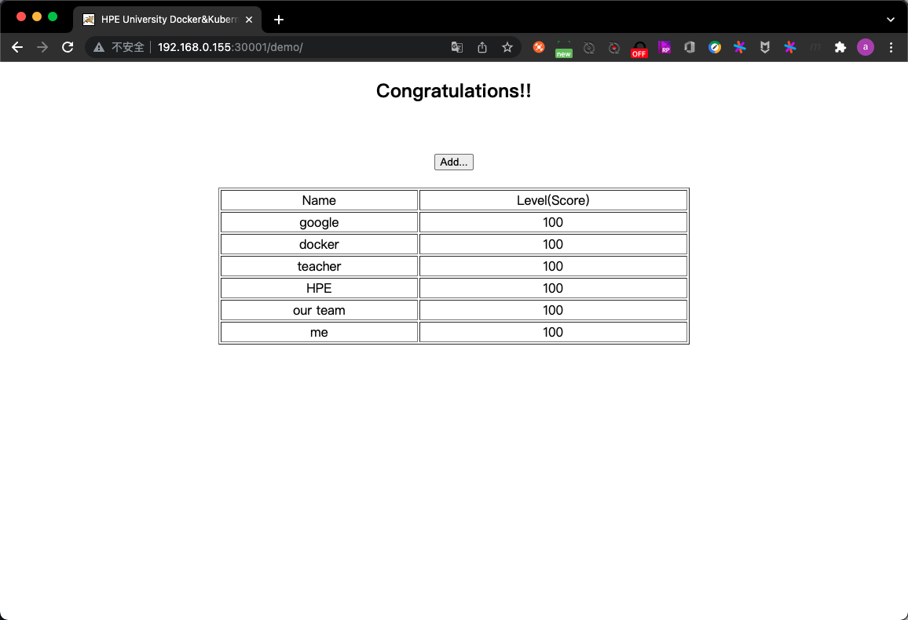
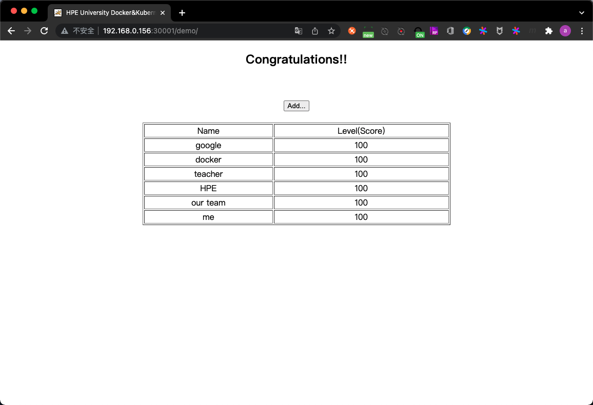

# 第1章 Kubernetes入门

## 1.1 了解Kubernetes

Kubernetes是什么?

- 首先,Kubernetes是Google十几年来大规模容器技术应用的重要成果,是Google严格保密十几年的秘密武器--Borg的一个开源版本

	Borg是Google内部使用的久负盛名的大规模集群管理系统,基于容器技术来实现资源管理的自动化,以及跨多个数据中心的资源利用率的最大化.十几年以来,Google一直通过Borg管理着数量庞大的应用程序集群.正是由于站在Borg这个前辈的肩膀上,汲取了Borg的经验与教 训,所以Kubernetes一经开源就一鸣惊人,并迅速称霸容器领域. Kubernetes也是一个全新的基于容器技术的分布式架构领先方案,是 容器云的优秀平台选型方案,已成为新一代的基于容器技术的PaaS平 台的重要底层框架,也是云原生技术生态圈的核心,服务网格 (Service Mesh)、无服务器架构(Serverless)等新一代分布式架构框架及技术纷纷基于Kubernetes实现,这些都奠定了Kubernetes在基础架构领域的王者地位.

- 其次,如果我们的系统设计遵循了Kubernetes的设计思想,那么传统系统架构中那些和业务没有太大关系的底层代码或功能模块,就都可以立刻从我们的视线中小时,不必再费心于负载均衡器的选型和部署实施问题,不必再考虑引入或自己开发一个复杂的服务治理框架,不必再头疼于服务监控和故障处理模块的开发

	总之,使用Kubernetes提供的解决方案,我们不仅节省了不少于30%的开发成本,还可以将精力更加集中于业务本身,而且由于Kubernetes提供了强大的自动化机制,所以系统后期的运维难度和运维成本大幅度降低.

- 第三,Kubernetes是一个开放的开发平台

	与J2EE不同,它不局限于任何一种语言,没有限定任何编程接口,所以不论是用Java、 Go、C++还是用Python编写的服务,都可以被映射为Kubernetes的Service(服务),并通过标准的TCP通信协议进行交互.此外,Kubernetes平台对现有的编程语言、编程框架、中间件没有任何侵入性,因此现有的系统也很容易改造升级并迁移到Kubernetes平台上.

- 最后,Kubernetes是一个完备的分布式系统支撑平台

	Kubernetes具有完备的集群管理能力,包括多层次的安全防护和准入机制、多租户应用支撑能力、透明的服务注册和服务发现机制、内建的智能负载均衡器、强大的故障发现和自我修复能力、服务滚动升级和在线扩容能力、可扩展的资源自动调度机制,以及多粒度的资源配额管理能力.同时,Kubernetes提供了完善的管理工具,这些工具涵盖了包括开发、部署测试、运维监控在内的各个环节.因此,Kubernetes是一个全新的基于容器技术的分布式架构解决方案,并且是一个一站式的 完备的分布式系统开发和支撑平台.

在正式开始本章的Hello World之旅之前,我们首先要了解 Kubernetes的一些基本知识,这样才能理解Kubernetes提供的解决方案.

在Kubernetes中,Service是分布式集群架构的核心.1个Service对象拥有如下关键特征:

- 拥有唯一指定的名称(例:mysql-server)
- 拥有一个虚拟IP地址(ClusterIP地址)和端口号
- 能够提供某种远程服务能力
- 能够将客户端对服务的访问请求转发到一组容器应用上

Service的服务进程通常基于Socket通信方式对外提供服务,比如Redis、Memcached、MySQL、Web Server,或者是实现了某个具体业务的特定TCP Server进程.虽然1个Service通常由多个相关的服务进程提供服务,每个服务进程都有一个独立的Endpoint(IP + Port)访问点,但Kubernetes能够让我们通过Service(ClusterIP + Service Port)连接指定的服务.有了Kubernetes内建的透明负载均衡和故障恢复机制,不管后端有多少个具体的服务进程,也不管某个服务进程是否由于发生故障而被重新部署到其他机器,都不会影响对服务的正常调用.更重要的是,这个Service本身一旦创建就不再变化,这意味着我们再也不用为Kubernetes集群中应用服务进程IP地址变来变去的问题头疼了.

容器提供了强大的隔离功能,所以我们有必要把为Service提供服务的这组进程放入到容器中进行隔离.为此,Kubernetes设计了Pod对象,将每个服务进程都包装到相应的Pod中,使其称为在Pod中运行的一个容器(Container).为了建立Service和Pod间的关联关系,Kubernetes首先给每个Pod都贴上一个标签(Label),比如给运行MySQL的Pod贴上name=mysql的标签,给运行PHP的Pod贴上name=php的标签,然后给响应的Service定义标签选择器(Lable Selector),例如,MySQL Service的标签选择器的选择条件为name=mysql,意为该Service要作用于所有包含name=mysql标签的Pod.这样一来,就巧妙解决了Service与Pod的关联问题.

这里先简单介绍Pod的概念.

- 首先,Pod运行在一个被称为节点(Node)的环境中,这个节点既可以是物理机,也可以是私有云或公有云中的一个虚拟机,在1个节点上能够运行多个Pod
- 其次,在每个Pod中都运行着一个特殊的被称为Pause的容器,其他容器则为业务容器,这些业务容器共享Pause容器的网络栈和Volume挂载卷,因此它们之间的通信和数据交换更为高效,在设计时我们可以充分利用这一特性,将一组密切相关的服务进程放入同一个Pod中
- 最后,需要注意的是,并不是每个Pod和它里面运行的容器都能被映射到一个Service上,只有提供服务(无论是对内还是对外)的那组Pod才会被映射为一个服务

在集群管理方面,Kubernetes将及群众的机器划分为1个Master和一些Node.在Master上运行着集群管理相关的一些进程:kube-apiserver、kube-controller-manager和kube-scheduler,这些进程实现了整个集群的资源管理、Pod调度、弹性伸缩、安全控制、系统监控和纠错等管理功能,并且都是自动完成的.Node作为集群中的工作节点,其上运行着真正的应用程序.在Node上,Kubernetes管理的最小运行单元是Pod.在Node上运行着Kubernetes的kubelet、kube-proxy服务进程,这些服务进程负责Pod的创建、启动、监控、重启、销毁,以及实现软件模式的负载均衡器.

这里讲一讲传统的IT系统中服务扩容和服务升级这两个难题,以及Kubernetes所提供的的全新解决思路.服务的扩容设计资源分配(选择哪个节点进行扩容)、实例部署和启动等环节.在一个复杂的业务系统汇总,这两个难题基本上要靠人工一步步操作才能得以解决,费时费力又难以保证实施质量.

在Kubernetes集群中,只需为需要扩容的Service关联的Pod创建一个Deployment对象,服务扩容甚至服务升级等头疼的问题就都解决了.在1个Deployment定义文件中,包括以下3个关键信息:

- 目标Pod的定义
- 目标Pod需要运行的副本数量(Replicas)
- 要监控的目标Pod标签

在创建好Deployment之后,Kubernetes会根据这一定义创建符合要求的Pod,并且通过在Deployment中定义的Label筛选出对应的Pod实例并实时监控其状态和数量.如果实例少于定义的副本数量,则会根据在Deployment对象中定义的Pod模板创建一个新的Pod,然后将此Pod调度到合适的Node上启动运行,直到Pod实例的数量达到预定目标.这个过程完全是自动化的,无需人工干预.有了Deployment,服务扩容就变成一个纯粹的简单数字游戏了,只需修改Deployment中的副本数量即可.后续的服务升级也将通过修改Deployment来自动完成.

## 1.2 为什么要用Kubernetes

使用Kubernetes的理由很多,最重要的理由是,**IT行业从来都是由 新技术驱动的**.Kubernetes是软件领域近几年来最具创新的容器技 术,涵盖了架构、研发、部署、运维等全系列软件开发流程,不仅对互联网公司的产品产生了极大影响,也对传统行业的IT技术产生了越来越强的冲击.基于Kubernetes的新一代容器架构已成为互联网产品及大规模系统的必选方案.2020年3月,虚拟化技术巨头VMware发布了使用Kubernetes重新打造的全新vSphere 7,向全球宣告了其拥抱 Kubernetes的决心,堪称虚拟化技术十年来最大的一次演进.vSphere 7通过底层重构,使得用户能够以ESXi管理VM虚拟机的方式来运用Kubernetes的能力.毫无疑问,VMware的这一举动将对IT行业带来重大影响,也宣告了以Kubernetes为核心的容器技术取代、融合虚拟机技术的时代正在加速到来.

如今,数百家厂商和技术社区共同构建了非常强大的云原生生态,市面上几乎所有提供云基础设施的公司都以原生形式将Kubernetes作为底层平台,可以预见,会有大量的新系统选择Kubernetes,不论这些新系统是运行在企业的本地服务器上,还是被托管到公有云上.阿里云容器服务Kubernetes版ACK(Alibaba Cloud Container Service for Kubernetes)是全球首批通过Kubernetes一致性认证的服务平台.据公开资料,截至2020年,在阿里云的ACK上,已经运行着上万个用户的Kubernetes集群.而腾讯自研的TKEx容器平台的底层也使用了Kubernetes原生技术,服务于腾讯的各种业务系统,包括腾讯会议、腾讯课堂、QQ及腾讯看点等,目前这些业务已运行的Kubernetes集群规模达到几百万CPU核数.百度云容器引擎(Cloud Container Engine)也采用Kubernetes作为容器集群管理系统,于2019年年底也得到了云原生计算基金会的官方认证,而在更早的2018年,百度的深度学习平台PaddlePaddle也宣布支持Kubernetes,并在当年成为Kubernetes官方唯一支持的深度学习框架.华为早在Kubernetes刚开源时就以社区创始成员及白金会员的身份加入其中,华为云的容器引 擎(CCE)也基于Kubernetes实现,同时补齐了完整的应用开发、交付 与运维流程,为客户提供完整的一站式云上应用生命周期管理方案.

使用Kubernetes的优点

- 首先,可以"轻装上阵"地开发负责系统

	以前需要很多人(其中不乏技术达人)一起分工协作才能设计、实现和运维的分布式系统,在采用Kubernetes解决方案之后,只需一个精悍的小团队就能轻松应对.在这个团队里,只需一名架构师负责系统中服务组件的架构设计,几名开发工程师负责业务代码的开发,一名系统兼运维工程师负责Kubernetes的部署和运维,因为Kubernetes已经帮我们做了很多.

- 其次,可以全面拥抱以微服务架构为核心思想的新一代容器技术的领先架构,包括基础的微服务架构,以及增强的微服务架构(如服务网格、无服务器架构等)

	微服务架构的核心是将一个巨大的单体应用分解为很多小的、相互连接的微服务,1个微服务可能由多个实例副本支撑,副本的数量可以随着系统的负荷变化进行调整.微服务架构使得每个服务都可以独立开发、升级和扩展,因此系统具备很高的稳定性和快速迭代能力,开发者也可以自由选择开发技术.Google、Amazon、eBay、Netflix等大型互联网公司都采用了微服务架构,Google更是将微服务架构的基础设施直接打包到Kubernetes解决方案中,让我们可以直接应用微服务架构解决复杂业务系统的架构问题.
	
- 第三,可以随时随地将系统整体“搬迁”到公有云上

	Kubernetes最初的设计目标就是让用户的应用运行在Google自家的公有云GCE中,华为云(CCE)、阿里云(ACK)和腾讯云(TKE)全部支持Kubernetes集群,未来会有更多的公有云及私有云支持Kubernetes.除了公有云,私有云也大量采用Kubernetes架构.在私有云与公有云融合的混合云领域,Kubernetes也大显身手.在Kubernetes和容器技术诞生之前,要实现多云和混合云是很困难的,应用开发商需要针对每个云服务商进行定制化开发,导致迁移云服务商时从基础架构到应用程序层面都需要做出相应的改动和适配.有了Kubernetes之后,用户本地的私有云(数据中心)可以与云服务商的Kubernetes集群保持一致的接口,这样应用程序在大部分情况下就不需要与具体的云服务商直接绑定了.
	
- 第四,Kubernetes内建的服务弹性扩容机制可以让我们轻松应对 突发流量

	在服务高峰期,我们可以选择在公有云中快速扩容某些Service的实例副本以提升系统的吞吐量,这样不仅节省了公司的硬件投入,还大大改善了用户体验.中国铁路总公司的12306购票系统,在客流高峰期(如节假日)就租用了阿里云进行分流

- 最后,Kubernetes系统架构超强的横向扩容能力可以让我们的竞 争力大大提升

	对于互联网公司来说,用户规模等价于资产,因此横向扩容能力是衡量互联网业务系统竞争力的关键指标.我们利用Kubernetes提供的工具,不用修改代码,就能将一个Kubernetes集群从只包含几个Node的小集群平滑扩展到拥有上百个Node的大集群,甚至可以在线完成集群扩容.只要微服务架构设计得合理,能够在多个云环境中进行弹性伸缩,系统就能够承受大量用户并发访问带来的巨大压力
	
## 1.3 从一个简单的例子开始

考虑到Kubernetes提供的`PHP` + `Redis`留言板的Hello World例子对于绝大多数新手来说比较复杂,难以顺利上手和实践,在此将其替换成一个简单得多的Java Web应用的例子,可以让新手快速上手和实践.

该应用是一个运行在Tomcat里的Web App,结构比较简单，如下图示.



JSP页面通过JDBC直接访问MySQL数据库并展示数据.这里出于演示和简化的目的,只要程序正确连接数据库,就会自动完成对应的Table创建与初始化数据的准备工作.所以,当我们通过浏览器访问此应用时,就会显示一个表格页面,其中包含来自数据库的内容.

此应用需要启动两个容器:Web App容器和MySQL容器,并且Web App容器需要访问MySQL容器.如果仅使用Docker启动这两个容器,则需要通过Docker Network或者端口映射的方式实现容器间的网络互访.本例介绍在Kubernetes系统中是如何实现的.

### 1.3.1 环境准备

[部署Kubernetes Cluster](https://github.com/rayallen20/Kubernetes-Authoritative-Guide/blob/main/Kubernetes%E9%83%A8%E7%BD%B2%E6%96%87%E6%A1%A3.md)

### 1.3.2 启动MySQL服务

- step1. 创建Deployment定义文件

在master节点上创建一个Deployment定义文件`mysql-deploy.yaml`:

```yaml
soap@k8s-master:~$ vim mysql-deploy.yaml 
soap@k8s-master:~$ cat mysql-deploy.yaml
# API版本
apiVersion: apps/v1
# 副本控制器Deployment
kind: Deployment
metadata:
  # 标签
  labels:
    app: mysql
  # 对象名称 全局唯一
  name: mysql
spec:
  # 预期的副本数量
  replicas: 1
  selector:
    matchLabels:
      app: mysql
  # Pod模板
  template:
    metadata:
      labels:
        app: mysql
    spec:
      # 定义容器
      containers:
        - image: mysql:5.7
          name: mysql
          ports:
          # 容器应用监听的端口号
          - containerPort: 3306
          # 注入容器内的环境变量
          env:
            - name: MYSQL_ROOT_PASSWORD
              value: "123456"
```

该YAML定义文件中:

- `kind`:该属性值表示此资源对象的类型,本例中该值表示这是一个Deployment
- `spec`:是Deployment的相关属性定义
	- `spec.selector`:Deployment的Pod选择器,符合该选择器条件的Pod实例将受到该Deployment的管理
	- `spec.replicas`:指定在当前Kubernetes Cluster中处于运行状态的Pod实例数量(此处设置`replicas=1`,表示只能运行1个MySQL Pod实例).
	- `spec.template`:当Kubernetes Cluster中运行的Pod数量少于`spec.replicas`指定的数量时,Deployment控制器会根据该部分定义的Pod模板生成新的Pod实例
		- `spec.template.metadata.labels`:指定该Pod的标签,该值必须匹配`spec.selector`

- step2. 将Deployment发布到Kubernetes Cluster中

创建好`mysql-deploy.yaml`文件后,为了将它发布到Kubernetes集群中,在Master上运行`kubectl apply -f mysql-deploy.yaml`:

```
soap@k8s-master:~$ kubectl apply -f mysql-deploy.yaml
deployment.apps/mysql created
```

- step3. 查看发布情况

查看创建的Deployment:

```
soap@k8s-master:~$ kubectl get deploy
NAME    READY   UP-TO-DATE   AVAILABLE   AGE
mysql   1/1     1            1           2m1s
```

查看Pod的创建情况:

```
soap@k8s-master:~$ kubectl get pods
NAME                     READY   STATUS    RESTARTS   AGE
mysql-596b96985c-7w9kv   1/1     Running   0          16m
```

可以看到一个名为`mysql-596b96985c-7w9kv`的实例,这是Kubernetes根据mysql这个Deployment的定义自动创建的Pod.由于Pod的调度和创建需要花费一定的时间,比如需要确认调度到哪个节点上,且下载Pod所需的容器镜像也需时间,因此一开始Pod一开始Pod的状态为Pending.可通过`kubectl logs POD_NAME`(本例中即为`kubectl logs mysql-596b96985c-7w9kv`)查看Pod的日志来确认创建Pod过程中是否存在错误.在Pod成功创建启动完成后,其状态最终会更新为Running.

可以在Kubernetes Cluster中的节点上通过`docker ps`查看正在运行的容器.发现提供MySQL服务的Pod容器已经创建并且正常运行(此处我的实验环境中除了Master节点外只有2个节点,所以我是挨个节点上执行的`docker ps`找到的),且MySQL Pod对应的容器多创建了一个Pause容器,该容器就是Pod的根容器.

```
[sudo] password for nikolai: 
CONTAINER ID   IMAGE                                                COMMAND                  CREATED          STATUS          PORTS     NAMES
7d83658d3440   mysql                                                "docker-entrypoint.s…"   20 minutes ago   Up 20 minutes             k8s_mysql_mysql-596b96985c-7w9kv_default_22c70018-03e1-445e-bc8c-9a73543e4b87_0
0d912aa46487   registry.aliyuncs.com/google_containers/pause:3.6    "/pause"                 21 minutes ago   Up 21 minutes             k8s_POD_mysql-596b96985c-7w9kv_default_22c70018-03e1-445e-bc8c-9a73543e4b87_0
...
2b0e4a897afe   registry.aliyuncs.com/google_containers/kube-proxy   "/usr/local/bin/kube…"   16 hours ago     Up 16 hours               k8s_kube-proxy_kube-proxy-n52bm_kube-system_0cf9ba55-698e-40bf-be16-8754155cf84a_0
```

注:此处为了看着明显,删掉了一些无关的容器信息.

- step4. 创建与该Deployment关联的Service定义文件

最后,创建一个与该Deployment关联的Kubernetes Service:MySQL的定义文件(文件名为`mysql-svc.yaml`),完整的内容和说明如下:

```
soap@k8s-master:~$ vim mysql-svc.yaml
soap@k8s-master:~$ cat mysql-svc.yaml 
apiVersion: v1
# 声明是Kubernetes Service
kind: Service
metadata:
  # Service的全局唯一名称
  name: mysql
spec:
  ports:
    # Service提供服务的端口号
    - port: 3306
  # Service对应的Pod拥有此处定义的标签
  selector:
    app: mysql
```

- `matadata.name`:Service的服务名(ServiceName)
- `spec.ports`:定义Service的虚端口
- `spec.selector`:选择器指定的Pod副本(实例)将对应本服务

- step5. 通过`kubectl create`命令创建Service对象

```
soap@k8s-master:~$ kubectl create -f mysql-svc.yaml
service/mysql created
```

- step6. 查看刚刚创建的Service对象

```
soap@k8s-master:~$ kubectl get svc mysql
NAME    TYPE        CLUSTER-IP     EXTERNAL-IP   PORT(S)    AGE
mysql   ClusterIP   10.107.16.60   <none>        3306/TCP   20s
```

可以发现,MySQL服务被分配的ClusterIP地址为`10.107.16.60`.之后,Kubernetes Cluster中新创建的其他Pod就可以通过该Service的ClusterIP + 端口号(3306)来连接和访问该Service了.

通常ClusterIP是在Service创建后,由Kubernetes系统自动分配的,其他Pod无法预先知道某个Service的ClusterIP地址,因此需要一个服务发现机制来找到这个服务.Kubernetes最初使用Linux环境变量(Environment Variable)来解决这个问题.根据Service的唯一名称,容器可以从环境变量中获取Service对应的ClusterIP地址和端口号,从而发起TCP/IP连接请求.

### 1.3.3 启动Tomcat应用

- step1. 创建Deployment定义文件

前面定义和启动了MySQL服务,接下来采用同样的步骤完成Tomcat应用的启动.首先,创建对应的RC文件`myweb-deploy.yaml`,内容如下:

```
soap@k8s-master:~$ vim myweb-deploy.yaml
soap@k8s-master:~$ cat myweb-deploy.yaml 
apiVersion: apps/v1
kind: Deployment
metadata:
  labels:
    app: myweb
  name: myweb
spec:
  replicas: 2
  selector:
    matchLabels:
      app: myweb
  template:
    metadata:
      labels:
        app: myweb
    spec:
      containers:
      - image: kubeguide/tomcat-app:v1
        name: web
        ports:
        - containerPort: 8080
        env:
        - name: MYSQL_SERVICE_HOST
          value: 10.107.16.60
```

注意:在Tomcat容器内,应用使用了环境变量`MYSQL_SERVICE_HOST`的值来连接MySQL服务,但是此处却并没有定义该环境变量.由于Kubernetes会自动将已存在的Service对象以环境变量的形式展现在新生成的Pod中,所以此处可以使用.更安全、可靠的方法是使用服务名称mysql,但这种方式要求Cluster内的DNS服务(`kube-dns`)正常运行.

- step2. 创建Deployment

```
soap@k8s-master:~$ kubectl apply -f myweb-deploy.yaml
deployment.apps/myweb created
```

- step3. 验证Deployment创建结果

```
soap@k8s-master:~$ kubectl get pods
NAME                     READY   STATUS    RESTARTS   AGE
mysql-596b96985c-7w9kv   1/1     Running   0          74m
myweb-6d5d5fccbc-pjxhc   1/1     Running   0          2m38s
myweb-6d5d5fccbc-s44f2   1/1     Running   0          2m38s
```

- step4. 创建与该Deployment关联的Service定义文件(`myweb-svc.yaml`)

```
soap@k8s-master:~$ vim myweb-svc.yaml
soap@k8s-master:~$ cat myweb-svc.yaml 
apiVersion: v1
kind: Service
metadata:
  name: myweb
spec:
  type: NodePort
  ports:
    - port: 8080
      nodePort: 30001
  selector:
    app: myweb
```

- `type.NodePort`:表示此Service开启NodePort格式的外网访问模式
- `port`:表示此Service的虚端口
- `nodePort`:表示此Service的外网访问端口

- step5. 创建Service

```
soap@k8s-master:~$ kubectl create -f myweb-svc.yaml
service/myweb created
```

- step6. 查看创建结果

```
soap@k8s-master:~$ kubectl get svc
NAME         TYPE        CLUSTER-IP      EXTERNAL-IP   PORT(S)          AGE
kubernetes   ClusterIP   10.96.0.1       <none>        443/TCP          22h
mysql        ClusterIP   10.107.16.60    <none>        3306/TCP         44m
myweb        NodePort    10.99.161.194   <none>        8080:30001/TCP   20s
```

### 1.3.4 通过浏览器访问网页





注:此处由于部署了2个myweb的Pod副本,所以在2个节点上都能访问到.

至此,就完成了在Kubernetes上部署一个Web App和数据库的 例子.可以看到,相对于传统的分布式应用部署方式,在Kubernetes之上仅通过一些很容易理解的配置文件和简单命令就能完成对整个集群的部署.

## 1.4 Kubernetes的基本概念和术语

### 1.4.1 资源对象概述

Kubernetes中的基本概念和术语大多是围绕资源对象(Resource Object)来说的,而资源对象在总体上可以分为以下2类:

1. 某种资源的对象,例如节点(Node)、Pod、服务(Service)、存储卷(Volume)
2. 与资源对象相关的事物与动作,例如标签(Label)、注解(Annotation)、命名空间(Namespace)、部署(Deployment)、HPA、PVC

资源对象一般包括几个通用属性:版本、类别(Kind)、名称、标签、注解:

1. 版本:版本信息包括了此对象所属的资源组,**一些资源对象的属性会随着的升级而变化**,在定义资源对象时,要特别注意这一点.
	- 例:`apiVersion: apps/v1`
2. 类别:类别属性用于定义资源对象的类型
	- 例:`kind: Deployment`
3. 元数据:资源对象的名称(Name)、标签、注解这3个属性属于资源对象的元数据(metadata)

	- 例:

	``` yaml
	...
	metadata:
	  # 标签
	  labels:
	    app: mysql
	  # 对象名称 全局唯一
	  name: mysql
	...
	```

	- 资源对象的名称要唯一(`metadata.name`)
	- 资源对象的标签是很重要的数据,也是Kubernetes的一大设计特性,比如通过标签来表明资源对象的特征、类别,以及通过标签筛选不同的资源对象并实现对象之间的关联、控制或协作功能(`metadata.labels`)
	- 注解可以被理解为一种特殊的标签,不过更多地是与程序挂钩,通常用于实现资源对象属性的自定义扩展(`metadata. annotations`)

我们可以采用YAML或JSON格式声明(定义或创建)一个Kubernetes资源对象,每个资源对象都有自己的特定结构定义(可以理解为数据库中一个特定的表),并且统一保存在etcd这种非关系型数据库中,以实现最快的读写速度.此外,所有资源对象都可以通过Kubernetes提供的kubectl工具(或者API编程调用)执行增、删、改、查等操作.

一些资源对象有自己的生命周期及相应的状态,此处以Pod为例说明:

- 通过kubectl客户端工具创建一个Pod并将其提交到系统中后.它就处于等待调度的状态
- 调度成功后为Pending状态,等待容器镜像下载和启动
- 启动成功后为Running状态
- 正常停止后为Succeeded状态
- 非正常停止后为Failed状态

同样,PV也是具有生命周期的资源对象.对于这类资源对象,我们还需要了解其生命周期的细节及状态变更的原因,这有助于快速排查故障.

另外,在学习时需要注意与该资源对象相关的其他资源对象或者事务,把握它们之间的关系,同时思考为什么会有这种资源对象产生,哪些是核心的资源对象,哪些是外围的资源对象.由于Kubernetes的快速发展,新的资源对象不断出现,一些旧的资源对象也被遗弃,这也是我们要与时俱进的原因

了更好地理解和学习Kubernetes的基本概念和术语,特别是数量众多的资源对象,这里按照功能或用途对其进行分类,将其分为集群类、应用类、存储类及安全类这四大类,在接下来的小节中一一讲解.

### 1.4.2 集群类

集群(Cluster)表示一个由Master和Node组成的Kubernetes集群.

#### 1. Master

Master:集群的控制节点.在每个Kubernetes集群汇总都需要有1个或1组被称为	Master的节点,来负责整个集群的管理和控制.Master通常占据一个独立的服务器(在高可用部署中建议至少使用3台服务器),是整个集群的"大脑",如果它发生宕机或不可用,那么对集群内容器应用的管理都将无法实施.

在Master上运行着以下关键进程:

- Kubernetes API Server(kube-apiserver):提供HTTP RESTful API接口的主要服务,是Kubernetes里对所有资源进行增、删、改、查等操作的唯一入口,也是集群控制的入口进程
- Kubernetes Controller Manager(kube-controller-manager):Kubernetes里所有资源对象的自动化控制中心,可以将其理解为资源对象的管理者
- Kubernetes Scheduler(kube-scheduler):负责资源调度(Pod调度)的进程

另外,在Master上通常还需要部署etcd服务

#### 2. Node

Node:Kubernetes Cluster中除Master外的其他服务器被称为Node.Node在较早的版本中也被称为Minion.与Master一样,Node可以是一台物理主机,也可以是一台虚拟机.Node是Kubernetes Cluster中的工作负载节点.每个Node都会被Master分配一些工作负载(Docker容器),当某个Node宕机时,其上的工作负载会被Master自动转移到其他Node上.在每个Node上都运行着以下关键进程:

- kubelet:负责Pod对应容器的创建、启停等任务,同时与Master密切协作,实现集群管理的基本功能
- kube-proxy:实现Kubernetes Service的通信与负载均衡机制的服务
- 容器运行时(如Docker):负责本机的容器创建和管理

Node可以在运行期间动态地增加到Kubernetes Cluster中,前提是在这个Node上已正确安装、配置和启动了以上关键进程.在默认情况下,kubelet会向Master注册自己,这也是Kubernetes推荐的Node管理方式.一旦Node被纳入集群管理范畴,kubelet进程就会定时向Master汇报自身的情况,这样Master就可以获知每个Node的资源使用情况,并实现高效均衡的资源调度策略.而某个Node在超过指定时长不上报信息时,会被Master判定为"失联",该Node的状态就被标记为不可用(Not Ready),Master随后会触发"工作负载大转移"的自动流程.

- 查看Cluster中Node的数量:`kubectl get nodes`

```
soap@k8s-master:~$ kubectl get nodes
NAME         STATUS   ROLES                  AGE   VERSION
k8s-master   Ready    control-plane,master   46h   v1.23.3
k8s-node1    Ready    <none>                 41h   v1.23.3
k8s-node2    Ready    <none>                 41h   v1.23.3
```

- 查看指定Node的详细信息:`kubectl describe node <node_name>`

```
soap@k8s-master:~$ kubectl describe node k8s-node1
Name:               k8s-node1
Roles:              <none>
Labels:             beta.kubernetes.io/arch=amd64
                    beta.kubernetes.io/os=linux
                    kubernetes.io/arch=amd64
                    kubernetes.io/hostname=k8s-node1
                    kubernetes.io/os=linux
Annotations:        flannel.alpha.coreos.com/backend-data: {"VNI":1,"VtepMAC":"6e:b2:0b:b1:9a:3d"}
                    flannel.alpha.coreos.com/backend-type: vxlan
                    flannel.alpha.coreos.com/kube-subnet-manager: true
                    flannel.alpha.coreos.com/public-ip: 192.168.0.155
                    kubeadm.alpha.kubernetes.io/cri-socket: /var/run/dockershim.sock
                    node.alpha.kubernetes.io/ttl: 0
                    volumes.kubernetes.io/controller-managed-attach-detach: true
CreationTimestamp:  Wed, 09 Feb 2022 15:53:08 +0000
Taints:             <none>
Unschedulable:      false
Lease:
  HolderIdentity:  k8s-node1
  AcquireTime:     <unset>
  RenewTime:       Fri, 11 Feb 2022 09:02:51 +0000
Conditions:
  Type                 Status  LastHeartbeatTime                 LastTransitionTime                Reason                       Message
  ----                 ------  -----------------                 ------------------                ------                       -------
  NetworkUnavailable   False   Wed, 09 Feb 2022 16:55:49 +0000   Wed, 09 Feb 2022 16:55:49 +0000   FlannelIsUp                  Flannel is running on this node
  MemoryPressure       False   Fri, 11 Feb 2022 08:58:40 +0000   Thu, 10 Feb 2022 19:00:36 +0000   KubeletHasSufficientMemory   kubelet has sufficient memory available
  DiskPressure         False   Fri, 11 Feb 2022 08:58:40 +0000   Thu, 10 Feb 2022 19:00:36 +0000   KubeletHasNoDiskPressure     kubelet has no disk pressure
  PIDPressure          False   Fri, 11 Feb 2022 08:58:40 +0000   Thu, 10 Feb 2022 19:00:36 +0000   KubeletHasSufficientPID      kubelet has sufficient PID available
  Ready                True    Fri, 11 Feb 2022 08:58:40 +0000   Thu, 10 Feb 2022 19:00:36 +0000   KubeletReady                 kubelet is posting ready status. AppArmor enabled
Addresses:
  InternalIP:  192.168.0.155
  Hostname:    k8s-node1
Capacity:
  cpu:                2
  ephemeral-storage:  20511312Ki
  hugepages-2Mi:      0
  memory:             12265188Ki
  pods:               110
Allocatable:
  cpu:                2
  ephemeral-storage:  18903225108
  hugepages-2Mi:      0
  memory:             12162788Ki
  pods:               110
System Info:
  Machine ID:                 63422ead17714842bfdf2115022d6afb
  System UUID:                52a31173-e6bb-9645-8a49-e7300766d7be
  Boot ID:                    239c48dc-04f5-4ea8-a945-6ee5282b7ac7
  Kernel Version:             5.4.0-97-generic
  OS Image:                   Ubuntu 20.04.3 LTS
  Operating System:           linux
  Architecture:               amd64
  Container Runtime Version:  docker://20.10.12
  Kubelet Version:            v1.23.3
  Kube-Proxy Version:         v1.23.3
PodCIDR:                      10.244.1.0/24
PodCIDRs:                     10.244.1.0/24
Non-terminated Pods:          (3 in total)
  Namespace                   Name                      CPU Requests  CPU Limits  Memory Requests  Memory Limits  Age
  ---------                   ----                      ------------  ----------  ---------------  -------------  ---
  default                     myweb-6d5d5fccbc-pjxhc    0 (0%)        0 (0%)      0 (0%)           0 (0%)         24h
  kube-system                 kube-flannel-ds-tx967     100m (5%)     100m (5%)   50Mi (0%)        50Mi (0%)      41h
  kube-system                 kube-proxy-5wvtm          0 (0%)        0 (0%)      0 (0%)           0 (0%)         41h
Allocated resources:
  (Total limits may be over 100 percent, i.e., overcommitted.)
  Resource           Requests   Limits
  --------           --------   ------
  cpu                100m (5%)  100m (5%)
  memory             50Mi (0%)  50Mi (0%)
  ephemeral-storage  0 (0%)     0 (0%)
  hugepages-2Mi      0 (0%)     0 (0%)
Events:              <none>
```

关键信息如下:

- Node的基本信息:名称、标签、创建时间等

	```
	Name:               k8s-node1
	Roles:              <none>
	Labels:             beta.kubernetes.io/arch=amd64
	                    beta.kubernetes.io/os=linux
	                    kubernetes.io/arch=amd64
	                    kubernetes.io/hostname=k8s-node1
	                    kubernetes.io/os=linux
	Annotations:        flannel.alpha.coreos.com/backend-data: {"VNI":1,"VtepMAC":"6e:b2:0b:b1:9a:3d"}
	                    flannel.alpha.coreos.com/backend-type: vxlan
	                    flannel.alpha.coreos.com/kube-subnet-manager: true
	                    flannel.alpha.coreos.com/public-ip: 192.168.0.155
	                    kubeadm.alpha.kubernetes.io/cri-socket: /var/run/dockershim.sock
	                    node.alpha.kubernetes.io/ttl: 0
	                    volumes.kubernetes.io/controller-managed-attach-detach: true
	CreationTimestamp:  Wed, 09 Feb 2022 15:53:08 +0000
	```

- Node当前的运行状态:Node启动后会做一系列的自检工作,比如磁盘空间是否不足(DiskPressure)、内存是否不足(MemoryPressure)、网络是否正常(NetworkUnavailable)、PID资源是否充足(PIDPressure).只有当一切正常时才会设置Node为Ready状态(`Ready=True`),表示Node处于健康状态,Master就可以在其上调度新的任务了(如启动Pod).

	```
	Conditions:
	  Type                 Status  LastHeartbeatTime                 LastTransitionTime                Reason                       Message
	  ----                 ------  -----------------                 ------------------                ------                       -------
	  NetworkUnavailable   False   Wed, 09 Feb 2022 16:55:49 +0000   Wed, 09 Feb 2022 16:55:49 +0000   FlannelIsUp                  Flannel is running on this node
	  MemoryPressure       False   Fri, 11 Feb 2022 08:58:40 +0000   Thu, 10 Feb 2022 19:00:36 +0000   KubeletHasSufficientMemory   kubelet has sufficient memory available
	  DiskPressure         False   Fri, 11 Feb 2022 08:58:40 +0000   Thu, 10 Feb 2022 19:00:36 +0000   KubeletHasNoDiskPressure     kubelet has no disk pressure
	  PIDPressure          False   Fri, 11 Feb 2022 08:58:40 +0000   Thu, 10 Feb 2022 19:00:36 +0000   KubeletHasSufficientPID      kubelet has sufficient PID available
	  Ready                True    Fri, 11 Feb 2022 08:58:40 +0000   Thu, 10 Feb 2022 19:00:36 +0000   KubeletReady                 kubelet is posting ready status. AppArmor enabled
	```

- Node的主机地址与主机名

	```
	Addresses:
	  InternalIP:  192.168.0.155
	  Hostname:    k8s-node1
	```

- Node上的资源数量:描述Node可用的系统资源,包括CPU、内存数量、最大可调度Pod数量等

	```
	Capacity:
	  cpu:                2
	  ephemeral-storage:  20511312Ki
	  hugepages-2Mi:      0
	  memory:             12265188Ki
	  pods:               110
	```

- Node可分配的资源量:描述Node当前可用于分配的资源量

	```
	Allocatable:
	  cpu:                2
	  ephemeral-storage:  18903225108
	  hugepages-2Mi:      0
	  memory:             12162788Ki
	  pods:               110
	```
- 主机系统信息:包括主机ID、系统UUID、Linux Kernel版本号、操作系统类型与版本、Docker版本号、kubelet与kube-proxy的版本号等

	```
	System Info:
	  Machine ID:                 63422ead17714842bfdf2115022d6afb
	  System UUID:                52a31173-e6bb-9645-8a49-e7300766d7be
	  Boot ID:                    239c48dc-04f5-4ea8-a945-6ee5282b7ac7
	  Kernel Version:             5.4.0-97-generic
	  OS Image:                   Ubuntu 20.04.3 LTS
	  Operating System:           linux
	  Architecture:               amd64
	  Container Runtime Version:  docker://20.10.12
	  Kubelet Version:            v1.23.3
	  Kube-Proxy Version:         v1.23.3
	```

- 当前运行的Pod列表概要信息

	```
	Non-terminated Pods:          (3 in total)
	  Namespace                   Name                      CPU Requests  CPU Limits  Memory Requests  Memory Limits  Age
	  ---------                   ----                      ------------  ----------  ---------------  -------------  ---
	  default                     myweb-6d5d5fccbc-pjxhc    0 (0%)        0 (0%)      0 (0%)           0 (0%)         24h
	  kube-system                 kube-flannel-ds-tx967     100m (5%)     100m (5%)   50Mi (0%)        50Mi (0%)      41h
	  kube-system                 kube-proxy-5wvtm          0 (0%)        0 (0%)      0 (0%)           0 (0%)         41h
	```

- 已分配的资源使用概要信息,例如资源申请的最小、最大允许使用量占系统总量的百分比

	```
	Allocated resources:
	  (Total limits may be over 100 percent, i.e., overcommitted.)
	  Resource           Requests   Limits
	  --------           --------   ------
	  cpu                100m (5%)  100m (5%)
	  memory             50Mi (0%)  50Mi (0%)
	  ephemeral-storage  0 (0%)     0 (0%)
	  hugepages-2Mi      0 (0%)     0 (0%)
	```

- Node相关的Event信息

	```
	Events:              <none>
	```

- 污点(Taints):如果一个Node存在问题(比如存在安全隐患、硬件资源不足要升级或者计划淘汰),就可以给该Node打一种特殊的标签:污点(Taints),避免新的容器被调度到该Node上.

	```
	Taints:             <none>
	```

- 容忍(Toleration):而如果某些Pod可以(短期)容忍(Toleration)某种污点的存在,则可以继续将该Pod调度到容忍的Node上

Taint与Toleration这两个术语属于Kubernetes调度相关的重要术语和概念

在集群类里还有一个重要的基础概念:命名空间.它在很多情况下用于实现多租户的资源隔离,典型的一种思路就是给每个租户都分配一个命名空间.命名空间属于Kubernetes Cluster范畴的资源对象,在一个集群里可以创建多个命名空间,每个命名空间都是相互独立的存在,属于不同命名空间的资源对象从逻辑上相互隔离.在每个Kubernetes集群安装完成且正常运行之后,Master会自动创建4个命名空间:

```
soap@k8s-master:~$ kubectl get namespace
NAME              STATUS   AGE
default           Active   47h
kube-node-lease   Active   47h
kube-public       Active   47h
kube-system       Active   47h
```

- default:默认命名空间.后续用户创建的资源对象如果没有指定命名空间,则被默认存放在default命名空间中
- kube-node-lease:用于在集群规模扩大时提高节点心跳机制的性能

	- 对于提升Kubernetes集群规模来说,NodeLease是一个非常重要的结构.在没有开启NodeLease之前,kubelet会使用Update Node Status的方式更新节点心跳,而一次这样的心跳会向API Server发送大约10KB数据量.

	- 在大规模场景下,API Server处理心跳请求是非常大的开销.而开启NodeLease之后,kubelet会使用非常轻量的NodeLease对象(0.1 KB)更新请求替换老的Update Node Status方式,这大大减轻了API Server 的负担.在上线NodeLease功能之后,集群API Server开销的CPU大约降低了一半.

- kube-public:自动创建且被所有用户可读的命名空间(包括未经身份认证的用户).此命名空间通常用于某些资源在整个集群中可见且可公开读取时被集群使用.此命名空间的公共方面只是一个约定,而不是一个必要条件
- kube-system:由Kubernetes系统创建的对象的命名空间.系统相关的资源对象如网络组件、DNS组件、监控类组件等都被安装在kube-system命名空间中

可以通过命名空间将集群内部的资源对象"分配"到不同的命名空间中,形成逻辑上分组的不同项目、小组或用户组,便于不同的分组在共享使用整个集群的资源的同时,还能被分别管理.当给每个租户都创建一个命名空间来实现多租户的资源隔离时,还能结合Kubernetes的资源配额管理,限定不同租户能占用的资源,例如CPU使用量、内存使用量等.

 - 定义一个名为development的命名空间

```
soap@k8s-master:~$ vim development-namespace.yaml
soap@k8s-master:~$ cat development-namespace.yaml
apiVersion: v1
kind: Namespace
metadata:
  name: development
```

- 创建命名空间development前

```
soap@k8s-master:~$ kubectl get namespaces
NAME              STATUS   AGE
default           Active   47h
kube-node-lease   Active   47h
kube-public       Active   47h
kube-system       Active   47h
```

- 创建命名空间development

```
soap@k8s-master:~$ kubectl create -f development-namespace.yaml 
namespace/development created
```

- 查看创建结果

```
soap@k8s-master:~$ kubectl get namespaces
NAME              STATUS   AGE
default           Active   47h
development       Active   29s
kube-node-lease   Active   47h
kube-public       Active   47h
kube-system       Active   47h
```

一旦创建了命名空间,我们在创建资源对象时就可以指定这个资源对象属于哪个命名空间:

例:定义一个名为busybox的Pod,并将该Pod放入名为development的命名空间中:

- 定义名为busybox的Pod

```
soap@k8s-master:~$ vim busybox-pod.yaml
soap@k8s-master:~$ cat busybox-pod.yaml
apiVersion: v1
kind: Pod
metadata:
  name: busybox
  namespace: development
spec:
  containers:
  - image: busybox
    command:
      - sleep
      - "3600"
    name: busybox
```

- 创建名为busybox的Pod前

```
soap@k8s-master:~$ kubectl get pods
NAME                     READY   STATUS    RESTARTS   AGE
mysql-596b96985c-7w9kv   1/1     Running   0          26h
myweb-6d5d5fccbc-pjxhc   1/1     Running   0          25h
myweb-6d5d5fccbc-s44f2   1/1     Running   0          25h
```

- 创建名为busybox的Pod

```
soap@k8s-master:~$ kubectl apply -f busybox-pod.yaml 
pod/busybox created
```

- 查看创建结果

```
soap@k8s-master:~$ kubectl get pods --namespace=development
NAME      READY   STATUS    RESTARTS   AGE
busybox   1/1     Running   0          40s
```

注意:参数`--namespace`表示指定查看某个命名空间下的pod情况.若不加该参数,则`kubectl get pods`命令默认查看default命名空间下的pod情况

创建Pod后使用`kubectl get pods`查看Pod的结果:

```
soap@k8s-master:~$ kubectl get pods
NAME                     READY   STATUS    RESTARTS   AGE
mysql-596b96985c-7w9kv   1/1     Running   0          26h
myweb-6d5d5fccbc-pjxhc   1/1     Running   0          25h
myweb-6d5d5fccbc-s44f2   1/1     Running   0          25h
```


	


