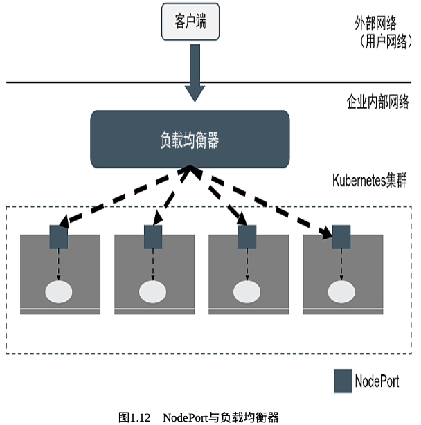

# 第1章 Kubernetes入门

## 1.1 了解Kubernetes

Kubernetes是什么?

- 首先,Kubernetes是Google十几年来大规模容器技术应用的重要成果,是Google严格保密十几年的秘密武器--Borg的一个开源版本

	Borg是Google内部使用的久负盛名的大规模集群管理系统,基于容器技术来实现资源管理的自动化,以及跨多个数据中心的资源利用率的最大化.十几年以来,Google一直通过Borg管理着数量庞大的应用程序集群.正是由于站在Borg这个前辈的肩膀上,汲取了Borg的经验与教 训,所以Kubernetes一经开源就一鸣惊人,并迅速称霸容器领域. Kubernetes也是一个全新的基于容器技术的分布式架构领先方案,是 容器云的优秀平台选型方案,已成为新一代的基于容器技术的PaaS平 台的重要底层框架,也是云原生技术生态圈的核心,服务网格 (Service Mesh)、无服务器架构(Serverless)等新一代分布式架构框架及技术纷纷基于Kubernetes实现,这些都奠定了Kubernetes在基础架构领域的王者地位.

- 其次,如果我们的系统设计遵循了Kubernetes的设计思想,那么传统系统架构中那些和业务没有太大关系的底层代码或功能模块,就都可以立刻从我们的视线中小时,不必再费心于负载均衡器的选型和部署实施问题,不必再考虑引入或自己开发一个复杂的服务治理框架,不必再头疼于服务监控和故障处理模块的开发

	总之,使用Kubernetes提供的解决方案,我们不仅节省了不少于30%的开发成本,还可以将精力更加集中于业务本身,而且由于Kubernetes提供了强大的自动化机制,所以系统后期的运维难度和运维成本大幅度降低.

- 第三,Kubernetes是一个开放的开发平台

	与J2EE不同,它不局限于任何一种语言,没有限定任何编程接口,所以不论是用Java、 Go、C++还是用Python编写的服务,都可以被映射为Kubernetes的Service(服务),并通过标准的TCP通信协议进行交互.此外,Kubernetes平台对现有的编程语言、编程框架、中间件没有任何侵入性,因此现有的系统也很容易改造升级并迁移到Kubernetes平台上.

- 最后,Kubernetes是一个完备的分布式系统支撑平台

	Kubernetes具有完备的集群管理能力,包括多层次的安全防护和准入机制、多租户应用支撑能力、透明的服务注册和服务发现机制、内建的智能负载均衡器、强大的故障发现和自我修复能力、服务滚动升级和在线扩容能力、可扩展的资源自动调度机制,以及多粒度的资源配额管理能力.同时,Kubernetes提供了完善的管理工具,这些工具涵盖了包括开发、部署测试、运维监控在内的各个环节.因此,Kubernetes是一个全新的基于容器技术的分布式架构解决方案,并且是一个一站式的 完备的分布式系统开发和支撑平台.

在正式开始本章的Hello World之旅之前,我们首先要了解 Kubernetes的一些基本知识,这样才能理解Kubernetes提供的解决方案.

在Kubernetes中,Service是分布式集群架构的核心.1个Service对象拥有如下关键特征:

- 拥有唯一指定的名称(例:mysql-server)
- 拥有一个虚拟IP地址(ClusterIP地址)和端口号
- 能够提供某种远程服务能力
- 能够将客户端对服务的访问请求转发到一组容器应用上

Service的服务进程通常基于Socket通信方式对外提供服务,比如Redis、Memcached、MySQL、Web Server,或者是实现了某个具体业务的特定TCP Server进程.虽然1个Service通常由多个相关的服务进程提供服务,每个服务进程都有一个独立的Endpoint(IP + Port)访问点,但Kubernetes能够让我们通过Service(ClusterIP + Service Port)连接指定的服务.有了Kubernetes内建的透明负载均衡和故障恢复机制,不管后端有多少个具体的服务进程,也不管某个服务进程是否由于发生故障而被重新部署到其他机器,都不会影响对服务的正常调用.更重要的是,这个Service本身一旦创建就不再变化,这意味着我们再也不用为Kubernetes集群中应用服务进程IP地址变来变去的问题头疼了.

容器提供了强大的隔离功能,所以我们有必要把为Service提供服务的这组进程放入到容器中进行隔离.为此,Kubernetes设计了Pod对象,将每个服务进程都包装到相应的Pod中,使其称为在Pod中运行的一个容器(Container).为了建立Service和Pod间的关联关系,Kubernetes首先给每个Pod都贴上一个标签(Label),比如给运行MySQL的Pod贴上name=mysql的标签,给运行PHP的Pod贴上name=php的标签,然后给响应的Service定义标签选择器(Lable Selector),例如,MySQL Service的标签选择器的选择条件为name=mysql,意为该Service要作用于所有包含name=mysql标签的Pod.这样一来,就巧妙解决了Service与Pod的关联问题.

这里先简单介绍Pod的概念.

- 首先,Pod运行在一个被称为节点(Node)的环境中,这个节点既可以是物理机,也可以是私有云或公有云中的一个虚拟机,在1个节点上能够运行多个Pod
- 其次,在每个Pod中都运行着一个特殊的被称为Pause的容器,其他容器则为业务容器,这些业务容器共享Pause容器的网络栈和Volume挂载卷,因此它们之间的通信和数据交换更为高效,在设计时我们可以充分利用这一特性,将一组密切相关的服务进程放入同一个Pod中
- 最后,需要注意的是,并不是每个Pod和它里面运行的容器都能被映射到一个Service上,只有提供服务(无论是对内还是对外)的那组Pod才会被映射为一个服务

在集群管理方面,Kubernetes将及群众的机器划分为1个Master和一些Node.在Master上运行着集群管理相关的一些进程:kube-apiserver、kube-controller-manager和kube-scheduler,这些进程实现了整个集群的资源管理、Pod调度、弹性伸缩、安全控制、系统监控和纠错等管理功能,并且都是自动完成的.Node作为集群中的工作节点,其上运行着真正的应用程序.在Node上,Kubernetes管理的最小运行单元是Pod.在Node上运行着Kubernetes的kubelet、kube-proxy服务进程,这些服务进程负责Pod的创建、启动、监控、重启、销毁,以及实现软件模式的负载均衡器.

这里讲一讲传统的IT系统中服务扩容和服务升级这两个难题,以及Kubernetes所提供的的全新解决思路.服务的扩容设计资源分配(选择哪个节点进行扩容)、实例部署和启动等环节.在一个复杂的业务系统汇总,这两个难题基本上要靠人工一步步操作才能得以解决,费时费力又难以保证实施质量.

在Kubernetes集群中,只需为需要扩容的Service关联的Pod创建一个Deployment对象,服务扩容甚至服务升级等头疼的问题就都解决了.在1个Deployment定义文件中,包括以下3个关键信息:

- 目标Pod的定义
- 目标Pod需要运行的副本数量(Replicas)
- 要监控的目标Pod标签

在创建好Deployment之后,Kubernetes会根据这一定义创建符合要求的Pod,并且通过在Deployment中定义的Label筛选出对应的Pod实例并实时监控其状态和数量.如果实例少于定义的副本数量,则会根据在Deployment对象中定义的Pod模板创建一个新的Pod,然后将此Pod调度到合适的Node上启动运行,直到Pod实例的数量达到预定目标.这个过程完全是自动化的,无需人工干预.有了Deployment,服务扩容就变成一个纯粹的简单数字游戏了,只需修改Deployment中的副本数量即可.后续的服务升级也将通过修改Deployment来自动完成.

## 1.2 为什么要用Kubernetes

使用Kubernetes的理由很多,最重要的理由是,**IT行业从来都是由 新技术驱动的**.Kubernetes是软件领域近几年来最具创新的容器技 术,涵盖了架构、研发、部署、运维等全系列软件开发流程,不仅对互联网公司的产品产生了极大影响,也对传统行业的IT技术产生了越来越强的冲击.基于Kubernetes的新一代容器架构已成为互联网产品及大规模系统的必选方案.2020年3月,虚拟化技术巨头VMware发布了使用Kubernetes重新打造的全新vSphere 7,向全球宣告了其拥抱 Kubernetes的决心,堪称虚拟化技术十年来最大的一次演进.vSphere 7通过底层重构,使得用户能够以ESXi管理VM虚拟机的方式来运用Kubernetes的能力.毫无疑问,VMware的这一举动将对IT行业带来重大影响,也宣告了以Kubernetes为核心的容器技术取代、融合虚拟机技术的时代正在加速到来.

如今,数百家厂商和技术社区共同构建了非常强大的云原生生态,市面上几乎所有提供云基础设施的公司都以原生形式将Kubernetes作为底层平台,可以预见,会有大量的新系统选择Kubernetes,不论这些新系统是运行在企业的本地服务器上,还是被托管到公有云上.阿里云容器服务Kubernetes版ACK(Alibaba Cloud Container Service for Kubernetes)是全球首批通过Kubernetes一致性认证的服务平台.据公开资料,截至2020年,在阿里云的ACK上,已经运行着上万个用户的Kubernetes集群.而腾讯自研的TKEx容器平台的底层也使用了Kubernetes原生技术,服务于腾讯的各种业务系统,包括腾讯会议、腾讯课堂、QQ及腾讯看点等,目前这些业务已运行的Kubernetes集群规模达到几百万CPU核数.百度云容器引擎(Cloud Container Engine)也采用Kubernetes作为容器集群管理系统,于2019年年底也得到了云原生计算基金会的官方认证,而在更早的2018年,百度的深度学习平台PaddlePaddle也宣布支持Kubernetes,并在当年成为Kubernetes官方唯一支持的深度学习框架.华为早在Kubernetes刚开源时就以社区创始成员及白金会员的身份加入其中,华为云的容器引 擎(CCE)也基于Kubernetes实现,同时补齐了完整的应用开发、交付 与运维流程,为客户提供完整的一站式云上应用生命周期管理方案.

使用Kubernetes的优点

- 首先,可以"轻装上阵"地开发负责系统

	以前需要很多人(其中不乏技术达人)一起分工协作才能设计、实现和运维的分布式系统,在采用Kubernetes解决方案之后,只需一个精悍的小团队就能轻松应对.在这个团队里,只需一名架构师负责系统中服务组件的架构设计,几名开发工程师负责业务代码的开发,一名系统兼运维工程师负责Kubernetes的部署和运维,因为Kubernetes已经帮我们做了很多.

- 其次,可以全面拥抱以微服务架构为核心思想的新一代容器技术的领先架构,包括基础的微服务架构,以及增强的微服务架构(如服务网格、无服务器架构等)

	微服务架构的核心是将一个巨大的单体应用分解为很多小的、相互连接的微服务,1个微服务可能由多个实例副本支撑,副本的数量可以随着系统的负荷变化进行调整.微服务架构使得每个服务都可以独立开发、升级和扩展,因此系统具备很高的稳定性和快速迭代能力,开发者也可以自由选择开发技术.Google、Amazon、eBay、Netflix等大型互联网公司都采用了微服务架构,Google更是将微服务架构的基础设施直接打包到Kubernetes解决方案中,让我们可以直接应用微服务架构解决复杂业务系统的架构问题.
	
- 第三,可以随时随地将系统整体“搬迁”到公有云上

	Kubernetes最初的设计目标就是让用户的应用运行在Google自家的公有云GCE中,华为云(CCE)、阿里云(ACK)和腾讯云(TKE)全部支持Kubernetes集群,未来会有更多的公有云及私有云支持Kubernetes.除了公有云,私有云也大量采用Kubernetes架构.在私有云与公有云融合的混合云领域,Kubernetes也大显身手.在Kubernetes和容器技术诞生之前,要实现多云和混合云是很困难的,应用开发商需要针对每个云服务商进行定制化开发,导致迁移云服务商时从基础架构到应用程序层面都需要做出相应的改动和适配.有了Kubernetes之后,用户本地的私有云(数据中心)可以与云服务商的Kubernetes集群保持一致的接口,这样应用程序在大部分情况下就不需要与具体的云服务商直接绑定了.
	
- 第四,Kubernetes内建的服务弹性扩容机制可以让我们轻松应对 突发流量

	在服务高峰期,我们可以选择在公有云中快速扩容某些Service的实例副本以提升系统的吞吐量,这样不仅节省了公司的硬件投入,还大大改善了用户体验.中国铁路总公司的12306购票系统,在客流高峰期(如节假日)就租用了阿里云进行分流

- 最后,Kubernetes系统架构超强的横向扩容能力可以让我们的竞 争力大大提升

	对于互联网公司来说,用户规模等价于资产,因此横向扩容能力是衡量互联网业务系统竞争力的关键指标.我们利用Kubernetes提供的工具,不用修改代码,就能将一个Kubernetes集群从只包含几个Node的小集群平滑扩展到拥有上百个Node的大集群,甚至可以在线完成集群扩容.只要微服务架构设计得合理,能够在多个云环境中进行弹性伸缩,系统就能够承受大量用户并发访问带来的巨大压力
	
## 1.3 从一个简单的例子开始

考虑到Kubernetes提供的`PHP` + `Redis`留言板的Hello World例子对于绝大多数新手来说比较复杂,难以顺利上手和实践,在此将其替换成一个简单得多的Java Web应用的例子,可以让新手快速上手和实践.

该应用是一个运行在Tomcat里的Web App,结构比较简单，如下图示.


JSP页面通过JDBC直接访问MySQL数据库并展示数据.这里出于演示和简化的目的,只要程序正确连接数据库,就会自动完成对应的Table创建与初始化数据的准备工作.所以,当我们通过浏览器访问此应用时,就会显示一个表格页面,其中包含来自数据库的内容.

此应用需要启动两个容器:Web App容器和MySQL容器,并且Web App容器需要访问MySQL容器.如果仅使用Docker启动这两个容器,则需要通过Docker Network或者端口映射的方式实现容器间的网络互访.本例介绍在Kubernetes系统中是如何实现的.

### 1.3.1 环境准备

[部署Kubernetes Cluster](https://github.com/rayallen20/Kubernetes-Authoritative-Guide/blob/main/Kubernetes%E9%83%A8%E7%BD%B2%E6%96%87%E6%A1%A3.md)

### 1.3.2 启动MySQL服务

- step1. 创建Deployment定义文件

在master节点上创建一个Deployment定义文件`mysql-deploy.yaml`:

```
soap@k8s-master:~$ vim mysql-deploy.yaml 
soap@k8s-master:~$ cat mysql-deploy.yaml
```

```yaml
# API版本
apiVersion: apps/v1
# 副本控制器Deployment
kind: Deployment
metadata:
  # 标签
  labels:
    app: mysql
  # 对象名称 全局唯一
  name: mysql
spec:
  # 预期的副本数量
  replicas: 1
  selector:
    matchLabels:
      app: mysql
  # Pod模板
  template:
    metadata:
      labels:
        app: mysql
    spec:
      # 定义容器
      containers:
        - image: mysql:5.7
          name: mysql
          ports:
          # 容器应用监听的端口号
          - containerPort: 3306
          # 注入容器内的环境变量
          env:
            - name: MYSQL_ROOT_PASSWORD
              value: "123456"
```

该YAML定义文件中:

- `kind`:该属性值表示此资源对象的类型,本例中该值表示这是一个Deployment
- `spec`:是Deployment的相关属性定义
	- `spec.selector`:Deployment的Pod选择器,符合该选择器条件的Pod实例将受到该Deployment的管理
	- `spec.replicas`:指定在当前Kubernetes Cluster中处于运行状态的Pod实例数量(此处设置`replicas=1`,表示只能运行1个MySQL Pod实例).
	- `spec.template`:当Kubernetes Cluster中运行的Pod数量少于`spec.replicas`指定的数量时,Deployment控制器会根据该部分定义的Pod模板生成新的Pod实例
		- `spec.template.metadata.labels`:指定该Pod的标签,该值必须匹配`spec.selector`

- step2. 将Deployment发布到Kubernetes Cluster中

创建好`mysql-deploy.yaml`文件后,为了将它发布到Kubernetes集群中,在Master上运行`kubectl apply -f mysql-deploy.yaml`:

```
soap@k8s-master:~$ kubectl apply -f mysql-deploy.yaml
deployment.apps/mysql created
```

- step3. 查看发布情况

查看创建的Deployment:

```
soap@k8s-master:~$ kubectl get deploy
NAME    READY   UP-TO-DATE   AVAILABLE   AGE
mysql   1/1     1            1           2m1s
```

查看Pod的创建情况:

```
soap@k8s-master:~$ kubectl get pods
NAME                     READY   STATUS    RESTARTS   AGE
mysql-596b96985c-7w9kv   1/1     Running   0          16m
```

可以看到一个名为`mysql-596b96985c-7w9kv`的实例,这是Kubernetes根据mysql这个Deployment的定义自动创建的Pod.由于Pod的调度和创建需要花费一定的时间,比如需要确认调度到哪个节点上,且下载Pod所需的容器镜像也需时间,因此一开始Pod一开始Pod的状态为Pending.可通过`kubectl logs POD_NAME`(本例中即为`kubectl logs mysql-596b96985c-7w9kv`)查看Pod的日志来确认创建Pod过程中是否存在错误.在Pod成功创建启动完成后,其状态最终会更新为Running.

可以在Kubernetes Cluster中的节点上通过`docker ps`查看正在运行的容器.发现提供MySQL服务的Pod容器已经创建并且正常运行(此处我的实验环境中除了Master节点外只有2个节点,所以我是挨个节点上执行的`docker ps`找到的),且MySQL Pod对应的容器多创建了一个Pause容器,该容器就是Pod的根容器.

```
[sudo] password for nikolai: 
CONTAINER ID   IMAGE                                                COMMAND                  CREATED          STATUS          PORTS     NAMES
7d83658d3440   mysql                                                "docker-entrypoint.s…"   20 minutes ago   Up 20 minutes             k8s_mysql_mysql-596b96985c-7w9kv_default_22c70018-03e1-445e-bc8c-9a73543e4b87_0
0d912aa46487   registry.aliyuncs.com/google_containers/pause:3.6    "/pause"                 21 minutes ago   Up 21 minutes             k8s_POD_mysql-596b96985c-7w9kv_default_22c70018-03e1-445e-bc8c-9a73543e4b87_0
...
2b0e4a897afe   registry.aliyuncs.com/google_containers/kube-proxy   "/usr/local/bin/kube…"   16 hours ago     Up 16 hours               k8s_kube-proxy_kube-proxy-n52bm_kube-system_0cf9ba55-698e-40bf-be16-8754155cf84a_0
```

注:此处为了看着明显,删掉了一些无关的容器信息.

- step4. 创建与该Deployment关联的Service定义文件

最后,创建一个与该Deployment关联的Kubernetes Service:MySQL的定义文件(文件名为`mysql-svc.yaml`),完整的内容和说明如下:

```
soap@k8s-master:~$ vim mysql-svc.yaml
soap@k8s-master:~$ cat mysql-svc.yaml 
```

```yaml
apiVersion: v1
# 声明是Kubernetes Service
kind: Service
metadata:
  # Service的全局唯一名称
  name: mysql
spec:
  ports:
    # Service提供服务的端口号
    - port: 3306
  # Service对应的Pod拥有此处定义的标签
  selector:
    app: mysql
```

- `matadata.name`:Service的服务名(ServiceName)
- `spec.ports`:定义Service的虚端口
- `spec.selector`:选择器指定的Pod副本(实例)将对应本服务

- step5. 通过`kubectl create`命令创建Service对象

```
soap@k8s-master:~$ kubectl create -f mysql-svc.yaml
service/mysql created
```

- step6. 查看刚刚创建的Service对象

```
soap@k8s-master:~$ kubectl get svc mysql
NAME    TYPE        CLUSTER-IP     EXTERNAL-IP   PORT(S)    AGE
mysql   ClusterIP   10.107.16.60   <none>        3306/TCP   20s
```

可以发现,MySQL服务被分配的ClusterIP地址为`10.107.16.60`.之后,Kubernetes Cluster中新创建的其他Pod就可以通过该Service的ClusterIP + 端口号(3306)来连接和访问该Service了.

通常ClusterIP是在Service创建后,由Kubernetes系统自动分配的,其他Pod无法预先知道某个Service的ClusterIP地址,因此需要一个服务发现机制来找到这个服务.Kubernetes最初使用Linux环境变量(Environment Variable)来解决这个问题.根据Service的唯一名称,容器可以从环境变量中获取Service对应的ClusterIP地址和端口号,从而发起TCP/IP连接请求.

### 1.3.3 启动Tomcat应用

- step1. 创建Deployment定义文件

前面定义和启动了MySQL服务,接下来采用同样的步骤完成Tomcat应用的启动.首先,创建对应的RC文件`myweb-deploy.yaml`,内容如下:

```
soap@k8s-master:~$ vim myweb-deploy.yaml
soap@k8s-master:~$ cat myweb-deploy.yaml 
```

```yaml
apiVersion: apps/v1
kind: Deployment
metadata:
  labels:
    app: myweb
  name: myweb
spec:
  replicas: 2
  selector:
    matchLabels:
      app: myweb
  template:
    metadata:
      labels:
        app: myweb
    spec:
      containers:
      - image: kubeguide/tomcat-app:v1
        name: web
        ports:
        - containerPort: 8080
        env:
        - name: MYSQL_SERVICE_HOST
          value: 10.107.16.60
```

注意:在Tomcat容器内,应用使用了环境变量`MYSQL_SERVICE_HOST`的值来连接MySQL服务,但是此处却并没有定义该环境变量.由于Kubernetes会自动将已存在的Service对象以环境变量的形式展现在新生成的Pod中,所以此处可以使用.更安全、可靠的方法是使用服务名称mysql,但这种方式要求Cluster内的DNS服务(`kube-dns`)正常运行.

- step2. 创建Deployment

```
soap@k8s-master:~$ kubectl apply -f myweb-deploy.yaml
deployment.apps/myweb created
```

- step3. 验证Deployment创建结果

```
soap@k8s-master:~$ kubectl get pods
NAME                     READY   STATUS    RESTARTS   AGE
mysql-596b96985c-7w9kv   1/1     Running   0          74m
myweb-6d5d5fccbc-pjxhc   1/1     Running   0          2m38s
myweb-6d5d5fccbc-s44f2   1/1     Running   0          2m38s
```

- step4. 创建与该Deployment关联的Service定义文件(`myweb-svc.yaml`)

```
soap@k8s-master:~$ vim myweb-svc.yaml
soap@k8s-master:~$ cat myweb-svc.yaml 
```

```yaml
apiVersion: v1
kind: Service
metadata:
  name: myweb
spec:
  type: NodePort
  ports:
    - port: 8080
      nodePort: 30001
  selector:
    app: myweb
```

- `type.NodePort`:表示此Service开启NodePort格式的外网访问模式
- `port`:表示此Service的虚端口
- `nodePort`:表示此Service的外网访问端口

- step5. 创建Service

```
soap@k8s-master:~$ kubectl create -f myweb-svc.yaml
service/myweb created
```

- step6. 查看创建结果

```
soap@k8s-master:~$ kubectl get svc
NAME         TYPE        CLUSTER-IP      EXTERNAL-IP   PORT(S)          AGE
kubernetes   ClusterIP   10.96.0.1       <none>        443/TCP          22h
mysql        ClusterIP   10.107.16.60    <none>        3306/TCP         44m
myweb        NodePort    10.99.161.194   <none>        8080:30001/TCP   20s
```

### 1.3.4 通过浏览器访问网页


注:此处由于部署了2个myweb的Pod副本,所以在2个节点上都能访问到.

至此,就完成了在Kubernetes上部署一个Web App和数据库的 例子.可以看到,相对于传统的分布式应用部署方式,在Kubernetes之上仅通过一些很容易理解的配置文件和简单命令就能完成对整个集群的部署.

## 1.4 Kubernetes的基本概念和术语

### 1.4.1 资源对象概述

Kubernetes中的基本概念和术语大多是围绕资源对象(Resource Object)来说的,而资源对象在总体上可以分为以下2类:

1. 某种资源的对象,例如节点(Node)、Pod、服务(Service)、存储卷(Volume)
2. 与资源对象相关的事物与动作,例如标签(Label)、注解(Annotation)、命名空间(Namespace)、部署(Deployment)、HPA、PVC

资源对象一般包括几个通用属性:版本、类别(Kind)、名称、标签、注解:

1. 版本:版本信息包括了此对象所属的资源组,**一些资源对象的属性会随着的升级而变化**,在定义资源对象时,要特别注意这一点.
	- 例:`apiVersion: apps/v1`
2. 类别:类别属性用于定义资源对象的类型
	- 例:`kind: Deployment`
3. 元数据:资源对象的名称(Name)、标签、注解这3个属性属于资源对象的元数据(metadata)

	- 例:

	``` yaml
	...
	metadata:
	  # 标签
	  labels:
	    app: mysql
	  # 对象名称 全局唯一
	  name: mysql
	...
	```

	- 资源对象的名称要唯一(`metadata.name`)
	- 资源对象的标签是很重要的数据,也是Kubernetes的一大设计特性,比如通过标签来表明资源对象的特征、类别,以及通过标签筛选不同的资源对象并实现对象之间的关联、控制或协作功能(`metadata.labels`)
	- 注解可以被理解为一种特殊的标签,不过更多地是与程序挂钩,通常用于实现资源对象属性的自定义扩展(`metadata. annotations`)

我们可以采用YAML或JSON格式声明(定义或创建)一个Kubernetes资源对象,每个资源对象都有自己的特定结构定义(可以理解为数据库中一个特定的表),并且统一保存在etcd这种非关系型数据库中,以实现最快的读写速度.此外,所有资源对象都可以通过Kubernetes提供的kubectl工具(或者API编程调用)执行增、删、改、查等操作.

一些资源对象有自己的生命周期及相应的状态,此处以Pod为例说明:

- 通过kubectl客户端工具创建一个Pod并将其提交到系统中后.它就处于等待调度的状态
- 调度成功后为Pending状态,等待容器镜像下载和启动
- 启动成功后为Running状态
- 正常停止后为Succeeded状态
- 非正常停止后为Failed状态

同样,PV也是具有生命周期的资源对象.对于这类资源对象,我们还需要了解其生命周期的细节及状态变更的原因,这有助于快速排查故障.

另外,在学习时需要注意与该资源对象相关的其他资源对象或者事务,把握它们之间的关系,同时思考为什么会有这种资源对象产生,哪些是核心的资源对象,哪些是外围的资源对象.由于Kubernetes的快速发展,新的资源对象不断出现,一些旧的资源对象也被遗弃,这也是我们要与时俱进的原因

了更好地理解和学习Kubernetes的基本概念和术语,特别是数量众多的资源对象,这里按照功能或用途对其进行分类,将其分为集群类、应用类、存储类及安全类这四大类,在接下来的小节中一一讲解.

### 1.4.2 集群类

集群(Cluster)表示一个由Master和Node组成的Kubernetes集群.

#### 1. Master

Master:集群的控制节点.在每个Kubernetes集群汇总都需要有1个或1组被称为	Master的节点,来负责整个集群的管理和控制.Master通常占据一个独立的服务器(在高可用部署中建议至少使用3台服务器),是整个集群的"大脑",如果它发生宕机或不可用,那么对集群内容器应用的管理都将无法实施.

在Master上运行着以下关键进程:

- Kubernetes API Server(kube-apiserver):提供HTTP RESTful API接口的主要服务,是Kubernetes里对所有资源进行增、删、改、查等操作的唯一入口,也是集群控制的入口进程
- Kubernetes Controller Manager(kube-controller-manager):Kubernetes里所有资源对象的自动化控制中心,可以将其理解为资源对象的管理者
- Kubernetes Scheduler(kube-scheduler):负责资源调度(Pod调度)的进程

另外,在Master上通常还需要部署etcd服务

#### 2. Node

Node:Kubernetes Cluster中除Master外的其他服务器被称为Node.Node在较早的版本中也被称为Minion.与Master一样,Node可以是一台物理主机,也可以是一台虚拟机.Node是Kubernetes Cluster中的工作负载节点.每个Node都会被Master分配一些工作负载(Docker容器),当某个Node宕机时,其上的工作负载会被Master自动转移到其他Node上.在每个Node上都运行着以下关键进程:

- kubelet:负责Pod对应容器的创建、启停等任务,同时与Master密切协作,实现集群管理的基本功能
- kube-proxy:实现Kubernetes Service的通信与负载均衡机制的服务
- 容器运行时(如Docker):负责本机的容器创建和管理

Node可以在运行期间动态地增加到Kubernetes Cluster中,前提是在这个Node上已正确安装、配置和启动了以上关键进程.在默认情况下,kubelet会向Master注册自己,这也是Kubernetes推荐的Node管理方式.一旦Node被纳入集群管理范畴,kubelet进程就会定时向Master汇报自身的情况,这样Master就可以获知每个Node的资源使用情况,并实现高效均衡的资源调度策略.而某个Node在超过指定时长不上报信息时,会被Master判定为"失联",该Node的状态就被标记为不可用(Not Ready),Master随后会触发"工作负载大转移"的自动流程.

- 查看Cluster中Node的数量:`kubectl get nodes`

```
soap@k8s-master:~$ kubectl get nodes
NAME         STATUS   ROLES                  AGE   VERSION
k8s-master   Ready    control-plane,master   46h   v1.23.3
k8s-node1    Ready    <none>                 41h   v1.23.3
k8s-node2    Ready    <none>                 41h   v1.23.3
```

- 查看指定Node的详细信息:`kubectl describe node <node_name>`

```
soap@k8s-master:~$ kubectl describe node k8s-node1
Name:               k8s-node1
Roles:              <none>
Labels:             beta.kubernetes.io/arch=amd64
                    beta.kubernetes.io/os=linux
                    kubernetes.io/arch=amd64
                    kubernetes.io/hostname=k8s-node1
                    kubernetes.io/os=linux
Annotations:        flannel.alpha.coreos.com/backend-data: {"VNI":1,"VtepMAC":"6e:b2:0b:b1:9a:3d"}
                    flannel.alpha.coreos.com/backend-type: vxlan
                    flannel.alpha.coreos.com/kube-subnet-manager: true
                    flannel.alpha.coreos.com/public-ip: 192.168.0.155
                    kubeadm.alpha.kubernetes.io/cri-socket: /var/run/dockershim.sock
                    node.alpha.kubernetes.io/ttl: 0
                    volumes.kubernetes.io/controller-managed-attach-detach: true
CreationTimestamp:  Wed, 09 Feb 2022 15:53:08 +0000
Taints:             <none>
Unschedulable:      false
Lease:
  HolderIdentity:  k8s-node1
  AcquireTime:     <unset>
  RenewTime:       Fri, 11 Feb 2022 09:02:51 +0000
Conditions:
  Type                 Status  LastHeartbeatTime                 LastTransitionTime                Reason                       Message
  ----                 ------  -----------------                 ------------------                ------                       -------
  NetworkUnavailable   False   Wed, 09 Feb 2022 16:55:49 +0000   Wed, 09 Feb 2022 16:55:49 +0000   FlannelIsUp                  Flannel is running on this node
  MemoryPressure       False   Fri, 11 Feb 2022 08:58:40 +0000   Thu, 10 Feb 2022 19:00:36 +0000   KubeletHasSufficientMemory   kubelet has sufficient memory available
  DiskPressure         False   Fri, 11 Feb 2022 08:58:40 +0000   Thu, 10 Feb 2022 19:00:36 +0000   KubeletHasNoDiskPressure     kubelet has no disk pressure
  PIDPressure          False   Fri, 11 Feb 2022 08:58:40 +0000   Thu, 10 Feb 2022 19:00:36 +0000   KubeletHasSufficientPID      kubelet has sufficient PID available
  Ready                True    Fri, 11 Feb 2022 08:58:40 +0000   Thu, 10 Feb 2022 19:00:36 +0000   KubeletReady                 kubelet is posting ready status. AppArmor enabled
Addresses:
  InternalIP:  192.168.0.155
  Hostname:    k8s-node1
Capacity:
  cpu:                2
  ephemeral-storage:  20511312Ki
  hugepages-2Mi:      0
  memory:             12265188Ki
  pods:               110
Allocatable:
  cpu:                2
  ephemeral-storage:  18903225108
  hugepages-2Mi:      0
  memory:             12162788Ki
  pods:               110
System Info:
  Machine ID:                 63422ead17714842bfdf2115022d6afb
  System UUID:                52a31173-e6bb-9645-8a49-e7300766d7be
  Boot ID:                    239c48dc-04f5-4ea8-a945-6ee5282b7ac7
  Kernel Version:             5.4.0-97-generic
  OS Image:                   Ubuntu 20.04.3 LTS
  Operating System:           linux
  Architecture:               amd64
  Container Runtime Version:  docker://20.10.12
  Kubelet Version:            v1.23.3
  Kube-Proxy Version:         v1.23.3
PodCIDR:                      10.244.1.0/24
PodCIDRs:                     10.244.1.0/24
Non-terminated Pods:          (3 in total)
  Namespace                   Name                      CPU Requests  CPU Limits  Memory Requests  Memory Limits  Age
  ---------                   ----                      ------------  ----------  ---------------  -------------  ---
  default                     myweb-6d5d5fccbc-pjxhc    0 (0%)        0 (0%)      0 (0%)           0 (0%)         24h
  kube-system                 kube-flannel-ds-tx967     100m (5%)     100m (5%)   50Mi (0%)        50Mi (0%)      41h
  kube-system                 kube-proxy-5wvtm          0 (0%)        0 (0%)      0 (0%)           0 (0%)         41h
Allocated resources:
  (Total limits may be over 100 percent, i.e., overcommitted.)
  Resource           Requests   Limits
  --------           --------   ------
  cpu                100m (5%)  100m (5%)
  memory             50Mi (0%)  50Mi (0%)
  ephemeral-storage  0 (0%)     0 (0%)
  hugepages-2Mi      0 (0%)     0 (0%)
Events:              <none>
```

关键信息如下:

- Node的基本信息:名称、标签、创建时间等

	```
	Name:               k8s-node1
	Roles:              <none>
	Labels:             beta.kubernetes.io/arch=amd64
	                    beta.kubernetes.io/os=linux
	                    kubernetes.io/arch=amd64
	                    kubernetes.io/hostname=k8s-node1
	                    kubernetes.io/os=linux
	Annotations:        flannel.alpha.coreos.com/backend-data: {"VNI":1,"VtepMAC":"6e:b2:0b:b1:9a:3d"}
	                    flannel.alpha.coreos.com/backend-type: vxlan
	                    flannel.alpha.coreos.com/kube-subnet-manager: true
	                    flannel.alpha.coreos.com/public-ip: 192.168.0.155
	                    kubeadm.alpha.kubernetes.io/cri-socket: /var/run/dockershim.sock
	                    node.alpha.kubernetes.io/ttl: 0
	                    volumes.kubernetes.io/controller-managed-attach-detach: true
	CreationTimestamp:  Wed, 09 Feb 2022 15:53:08 +0000
	```

- Node当前的运行状态:Node启动后会做一系列的自检工作,比如磁盘空间是否不足(DiskPressure)、内存是否不足(MemoryPressure)、网络是否正常(NetworkUnavailable)、PID资源是否充足(PIDPressure).只有当一切正常时才会设置Node为Ready状态(`Ready=True`),表示Node处于健康状态,Master就可以在其上调度新的任务了(如启动Pod).

	```
	Conditions:
	  Type                 Status  LastHeartbeatTime                 LastTransitionTime                Reason                       Message
	  ----                 ------  -----------------                 ------------------                ------                       -------
	  NetworkUnavailable   False   Wed, 09 Feb 2022 16:55:49 +0000   Wed, 09 Feb 2022 16:55:49 +0000   FlannelIsUp                  Flannel is running on this node
	  MemoryPressure       False   Fri, 11 Feb 2022 08:58:40 +0000   Thu, 10 Feb 2022 19:00:36 +0000   KubeletHasSufficientMemory   kubelet has sufficient memory available
	  DiskPressure         False   Fri, 11 Feb 2022 08:58:40 +0000   Thu, 10 Feb 2022 19:00:36 +0000   KubeletHasNoDiskPressure     kubelet has no disk pressure
	  PIDPressure          False   Fri, 11 Feb 2022 08:58:40 +0000   Thu, 10 Feb 2022 19:00:36 +0000   KubeletHasSufficientPID      kubelet has sufficient PID available
	  Ready                True    Fri, 11 Feb 2022 08:58:40 +0000   Thu, 10 Feb 2022 19:00:36 +0000   KubeletReady                 kubelet is posting ready status. AppArmor enabled
	```

- Node的主机地址与主机名

	```
	Addresses:
	  InternalIP:  192.168.0.155
	  Hostname:    k8s-node1
	```

- Node上的资源数量:描述Node可用的系统资源,包括CPU、内存数量、最大可调度Pod数量等

	```
	Capacity:
	  cpu:                2
	  ephemeral-storage:  20511312Ki
	  hugepages-2Mi:      0
	  memory:             12265188Ki
	  pods:               110
	```

- Node可分配的资源量:描述Node当前可用于分配的资源量

	```
	Allocatable:
	  cpu:                2
	  ephemeral-storage:  18903225108
	  hugepages-2Mi:      0
	  memory:             12162788Ki
	  pods:               110
	```
- 主机系统信息:包括主机ID、系统UUID、Linux Kernel版本号、操作系统类型与版本、Docker版本号、kubelet与kube-proxy的版本号等

	```
	System Info:
	  Machine ID:                 63422ead17714842bfdf2115022d6afb
	  System UUID:                52a31173-e6bb-9645-8a49-e7300766d7be
	  Boot ID:                    239c48dc-04f5-4ea8-a945-6ee5282b7ac7
	  Kernel Version:             5.4.0-97-generic
	  OS Image:                   Ubuntu 20.04.3 LTS
	  Operating System:           linux
	  Architecture:               amd64
	  Container Runtime Version:  docker://20.10.12
	  Kubelet Version:            v1.23.3
	  Kube-Proxy Version:         v1.23.3
	```

- 当前运行的Pod列表概要信息

	```
	Non-terminated Pods:          (3 in total)
	  Namespace                   Name                      CPU Requests  CPU Limits  Memory Requests  Memory Limits  Age
	  ---------                   ----                      ------------  ----------  ---------------  -------------  ---
	  default                     myweb-6d5d5fccbc-pjxhc    0 (0%)        0 (0%)      0 (0%)           0 (0%)         24h
	  kube-system                 kube-flannel-ds-tx967     100m (5%)     100m (5%)   50Mi (0%)        50Mi (0%)      41h
	  kube-system                 kube-proxy-5wvtm          0 (0%)        0 (0%)      0 (0%)           0 (0%)         41h
	```

- 已分配的资源使用概要信息,例如资源申请的最小、最大允许使用量占系统总量的百分比

	```
	Allocated resources:
	  (Total limits may be over 100 percent, i.e., overcommitted.)
	  Resource           Requests   Limits
	  --------           --------   ------
	  cpu                100m (5%)  100m (5%)
	  memory             50Mi (0%)  50Mi (0%)
	  ephemeral-storage  0 (0%)     0 (0%)
	  hugepages-2Mi      0 (0%)     0 (0%)
	```

- Node相关的Event信息

	```
	Events:              <none>
	```

- 污点(Taints):如果一个Node存在问题(比如存在安全隐患、硬件资源不足要升级或者计划淘汰),就可以给该Node打一种特殊的标签:污点(Taints),避免新的容器被调度到该Node上.

	```
	Taints:             <none>
	```

- 容忍(Toleration):而如果某些Pod可以(短期)容忍(Toleration)某种污点的存在,则可以继续将该Pod调度到容忍的Node上

Taint与Toleration这两个术语属于Kubernetes调度相关的重要术语和概念

在集群类里还有一个重要的基础概念:命名空间.它在很多情况下用于实现多租户的资源隔离,典型的一种思路就是给每个租户都分配一个命名空间.命名空间属于Kubernetes Cluster范畴的资源对象,在一个集群里可以创建多个命名空间,每个命名空间都是相互独立的存在,属于不同命名空间的资源对象从逻辑上相互隔离.在每个Kubernetes集群安装完成且正常运行之后,Master会自动创建4个命名空间:

```
soap@k8s-master:~$ kubectl get namespace
NAME              STATUS   AGE
default           Active   47h
kube-node-lease   Active   47h
kube-public       Active   47h
kube-system       Active   47h
```

- default:默认命名空间.后续用户创建的资源对象如果没有指定命名空间,则被默认存放在default命名空间中
- kube-node-lease:用于在集群规模扩大时提高节点心跳机制的性能

	- 对于提升Kubernetes集群规模来说,NodeLease是一个非常重要的结构.在没有开启NodeLease之前,kubelet会使用Update Node Status的方式更新节点心跳,而一次这样的心跳会向API Server发送大约10KB数据量.

	- 在大规模场景下,API Server处理心跳请求是非常大的开销.而开启NodeLease之后,kubelet会使用非常轻量的NodeLease对象(0.1 KB)更新请求替换老的Update Node Status方式,这大大减轻了API Server 的负担.在上线NodeLease功能之后,集群API Server开销的CPU大约降低了一半.

- kube-public:自动创建且被所有用户可读的命名空间(包括未经身份认证的用户).此命名空间通常用于某些资源在整个集群中可见且可公开读取时被集群使用.此命名空间的公共方面只是一个约定,而不是一个必要条件
- kube-system:由Kubernetes系统创建的对象的命名空间.系统相关的资源对象如网络组件、DNS组件、监控类组件等都被安装在kube-system命名空间中

可以通过命名空间将集群内部的资源对象"分配"到不同的命名空间中,形成逻辑上分组的不同项目、小组或用户组,便于不同的分组在共享使用整个集群的资源的同时,还能被分别管理.当给每个租户都创建一个命名空间来实现多租户的资源隔离时,还能结合Kubernetes的资源配额管理,限定不同租户能占用的资源,例如CPU使用量、内存使用量等.

 - 定义一个名为development的命名空间

```
soap@k8s-master:~$ vim development-namespace.yaml
soap@k8s-master:~$ cat development-namespace.yaml
```

```yaml
apiVersion: v1
kind: Namespace
metadata:
  name: development
```

- 创建命名空间development前

```
soap@k8s-master:~$ kubectl get namespaces
NAME              STATUS   AGE
default           Active   47h
kube-node-lease   Active   47h
kube-public       Active   47h
kube-system       Active   47h
```

- 创建命名空间development

```
soap@k8s-master:~$ kubectl create -f development-namespace.yaml 
namespace/development created
```

- 查看创建结果

```
soap@k8s-master:~$ kubectl get namespaces
NAME              STATUS   AGE
default           Active   47h
development       Active   29s
kube-node-lease   Active   47h
kube-public       Active   47h
kube-system       Active   47h
```

一旦创建了命名空间,我们在创建资源对象时就可以指定这个资源对象属于哪个命名空间:

例:定义一个名为busybox的Pod,并将该Pod放入名为development的命名空间中:

- 定义名为busybox的Pod

```
soap@k8s-master:~$ vim busybox-pod.yaml
soap@k8s-master:~$ cat busybox-pod.yaml
```

```yaml
apiVersion: v1
kind: Pod
metadata:
  name: busybox
  namespace: development
spec:
  containers:
  - image: busybox
    command:
      - sleep
      - "3600"
    name: busybox
```

- 创建名为busybox的Pod前

```
soap@k8s-master:~$ kubectl get pods
NAME                     READY   STATUS    RESTARTS   AGE
mysql-596b96985c-7w9kv   1/1     Running   0          26h
myweb-6d5d5fccbc-pjxhc   1/1     Running   0          25h
myweb-6d5d5fccbc-s44f2   1/1     Running   0          25h
```

- 创建名为busybox的Pod

```
soap@k8s-master:~$ kubectl apply -f busybox-pod.yaml 
pod/busybox created
```

- 查看创建结果

```
soap@k8s-master:~$ kubectl get pods --namespace=development
NAME      READY   STATUS    RESTARTS   AGE
busybox   1/1     Running   0          40s
```

注意:参数`--namespace`表示指定查看某个命名空间下的pod情况.若不加该参数,则`kubectl get pods`命令默认查看default命名空间下的pod情况

创建Pod后使用`kubectl get pods`查看Pod的结果:

```
soap@k8s-master:~$ kubectl get pods
NAME                     READY   STATUS    RESTARTS   AGE
mysql-596b96985c-7w9kv   1/1     Running   0          26h
myweb-6d5d5fccbc-pjxhc   1/1     Running   0          25h
myweb-6d5d5fccbc-s44f2   1/1     Running   0          25h
```

### 1.4.3 应用类

Kubernetes中属于应用类的概念和相应的资源对象类型最多,所以应用类也是要重点学习的一类.

#### 1. Service与Pod

应用类相关的资源对象主要是围绕Service(服务)和Pod这两个核心对象展开的.

##### a. Service

Service:一般指无状态服务,通常由多个程序副本提供服务,在特殊情况下也可以是有状态的单实例服务,比如MySQL这种数据存储类服务.和常规理解的服务不同,Kubernetes中的Service具有一个**全局唯一**的虚拟ClusterIP地址,Service一旦被创建,Kubernetes就会自动为其分配一个可用的ClusterIP地址,而且在Service的整个生命周期中,它的ClusterIP地址都不会改变,客户端可以通过虚拟IP地址 + 服务端口直接访问到该服务,再通过部署Kubernetes Cluster的DNS服务,就可以实现Service Name(域名)到ClusterIP地址的DNS映射功能,我们只要使用服务的名称(DNS名称)即可完成到目标服务的访问请求.传统架构中的棘手问题:服务发现,用这种方式得到了解决.同时,ClusterIP地址的设计,使得Kubernetes进一步实现了Service的透明负载均衡和故障自动恢复的高级特性.

```
soap@k8s-master:~$ kubectl get services
NAME         TYPE        CLUSTER-IP      EXTERNAL-IP   PORT(S)          AGE
kubernetes   ClusterIP   10.96.0.1       <none>        443/TCP          2d3h
mysql        ClusterIP   10.107.16.60    <none>        3306/TCP         29h
myweb        NodePort    10.99.161.194   <none>        8080:30001/TCP   28h
```

通过分析、识别并建模系统中的所有服务,将它们都转换为微服务(Kubernetes Service),系统最终由多个提供不同业务能力而又彼此独立的微服务单元组成,服务之间通过TCP/IP进行通信,从而形成 强大又灵活的弹性网格,拥有强大的分布式能力、弹性扩展能力、容错能力,程序架构也变得简单和直观许多.


##### b. Pod

接下来说说与Service密切相关的核心资源对象:Pod.

Pod是Kubernetes中最重要的基本概念之一,Pod的组成示意图如下:


- Pause容器:每个Pod都有一个特殊的被称为"根容器"的Pause容器.Pause容器对应的镜像属于Kubernetes平台的一部分.
- 其他容器:每个Pod包含1个或多个紧密相关的用户业务容器

Kubernetes设计Pod且Pod有这样的结构的原因:

- 为多进程之间的协作提供一个抽象模型,使用Pod作为基本的调度、复制等管理工作的最小单位,让多个应用进程能一起有效地调度和伸缩
- Pod里的多个业务容器共享Pause容器的IP和Pause容器挂载的Volume,这样既简化了密切关联的业务容器之间的通信问题,也很好地解决了它们之间的文件共享问题

Kubernetes为每个Pod都分配了唯一的IP地址,称为Pod IP.1个Pod中的多个容器共享Pod IP地址.Kubernetes要求底层网络支持Cluster内的任意2个Pod之间的TCP/IP直接通信,这通常采用[虚拟的二层网络技术](https://github.com/rayallen20/cloudNativeExercise/blob/master/note/module3-Docker%20core%20technology/class5-%E5%AE%B9%E5%99%A8%E7%BD%91%E7%BB%9C/class5-%E5%AE%B9%E5%99%A8%E7%BD%91%E7%BB%9C.md#33-%E7%BD%91%E7%BB%9C%E6%8F%92%E4%BB%B6-%E4%BB%A5flannel%E4%B8%BA%E4%BE%8B)实现,例如Flannel、Open vSwitch等,因此需要记住的是:**在Kubernetes中,一个Pod中的容器和其他主机上Pod中的容器能够直接通信.**

```
soap@k8s-master:~$ kubectl get pods -A -o wide
NAMESPACE     NAME                                 READY   STATUS    RESTARTS      AGE     IP              NODE         NOMINATED NODE   READINESS GATES
default       mysql-596b96985c-7w9kv               1/1     Running   0             30h     10.244.2.2      k8s-node2    <none>           <none>
default       myweb-6d5d5fccbc-pjxhc               1/1     Running   0             29h     10.244.1.2      k8s-node1    <none>           <none>
default       myweb-6d5d5fccbc-s44f2               1/1     Running   0             29h     10.244.2.3      k8s-node2    <none>           <none>
development   busybox                              1/1     Running   3 (46m ago)   3h47m   10.244.1.3      k8s-node1    <none>           <none>
kube-system   coredns-55dffbd598-8rcfq             1/1     Running   0             2d3h    10.244.0.3      k8s-master   <none>           <none>
kube-system   coredns-55dffbd598-w4c4z             1/1     Running   0             2d3h    10.244.0.2      k8s-master   <none>           <none>
kube-system   etcd-k8s-master                      1/1     Running   0             2d3h    192.168.0.154   k8s-master   <none>           <none>
kube-system   kube-apiserver-k8s-master            1/1     Running   0             2d3h    192.168.0.154   k8s-master   <none>           <none>
kube-system   kube-controller-manager-k8s-master   1/1     Running   0             2d3h    192.168.0.154   k8s-master   <none>           <none>
kube-system   kube-flannel-ds-7w96q                1/1     Running   0             46h     192.168.0.154   k8s-master   <none>           <none>
kube-system   kube-flannel-ds-dxwnk                1/1     Running   0             45h     192.168.0.156   k8s-node2    <none>           <none>
kube-system   kube-flannel-ds-tx967                1/1     Running   0             45h     192.168.0.155   k8s-node1    <none>           <none>
kube-system   kube-proxy-5wvtm                     1/1     Running   0             45h     192.168.0.155   k8s-node1    <none>           <none>
kube-system   kube-proxy-n52bm                     1/1     Running   0             45h     192.168.0.156   k8s-node2    <none>           <none>
kube-system   kube-proxy-qzxsp                     1/1     Running   0             2d3h    192.168.0.154   k8s-master   <none>           <none>
kube-system   kube-scheduler-k8s-master            1/1     Running   0             2d3h    192.168.0.154   k8s-master   <none>           <none>
```

注:此处busybox的重启是由于定义时通过commands指定了容器每1h重启1次,并非Pod启动失败.

```
soap@k8s-master:~$ kubectl logs busybox -n development
```

```
allen@k8s-node1:~$ sudo docker logs 51e86ca6402d
allen@k8s-node1:~$ sudo docker ps
CONTAINER ID   IMAGE                                                COMMAND                  CREATED          STATUS          PORTS     NAMES
51e86ca6402d   busybox                                              "sleep 3600"             52 minutes ago   Up 52 minutes             k8s_busybox_busybox_development_dd3da318-a83a-45d0-ba71-470f3708a4d5_5
50338b44ae96   registry.aliyuncs.com/google_containers/pause:3.6    "/pause"                 6 hours ago      Up 6 hours                k8s_POD_busybox_development_dd3da318-a83a-45d0-ba71-470f3708a4d5_0
579e3d54df61   kubeguide/tomcat-app                                 "catalina.sh run"        31 hours ago     Up 31 hours               k8s_web_myweb-6d5d5fccbc-pjxhc_default_ba960c26-3dc1-4d3e-8ebf-420d45372c2c_0
a057b63466db   registry.aliyuncs.com/google_containers/pause:3.6    "/pause"                 31 hours ago     Up 31 hours               k8s_POD_myweb-6d5d5fccbc-pjxhc_default_ba960c26-3dc1-4d3e-8ebf-420d45372c2c_0
e2fa65023fb0   8cb5de74f107                                         "/opt/bin/flanneld -…"   47 hours ago     Up 47 hours               k8s_kube-flannel_kube-flannel-ds-tx967_kube-system_5c17a2fe-70f6-4350-9005-1b3b1ea1e9f1_0
dca117d2a724   registry.aliyuncs.com/google_containers/kube-proxy   "/usr/local/bin/kube…"   2 days ago       Up 2 days                 k8s_kube-proxy_kube-proxy-5wvtm_kube-system_81fe160b-3357-45a4-9674-7326e1b15aa3_0
fc38d9748b93   registry.aliyuncs.com/google_containers/pause:3.6    "/pause"                 2 days ago       Up 2 days                 k8s_POD_kube-flannel-ds-tx967_kube-system_5c17a2fe-70f6-4350-9005-1b3b1ea1e9f1_0
cb88cc334821   registry.aliyuncs.com/google_containers/pause:3.6    "/pause"                 2 days ago       Up 2 days                 k8s_POD_kube-proxy-5wvtm_kube-system_81fe160b-3357-45a4-9674-7326e1b15aa3_0
allen@k8s-node1:~$ sudo docker logs 51e86ca6402d
```

可以看到日志中是没有信息的.

Pod有2种类型:

- 普通的Pod

	- 普通的Pod一旦被创建,就会被放入etcd存储,随后被Kubernetes Master调度到某个具体的Node上并绑定(Binding).该Pod被运行它的Node上的kubelet进程实例化成一组相关的Docker容器并启动.在默认情况下,当Pod中的某个容器停止时,Kubernetes会自动检测到这个问题并且重新启动这个Pod(即:重启Pod中的所有容器),如果Pod所在的Node宕机,就会将该Node上所有的Pod都重新调度到其他节点上.

- 静态Pod(Static Pod)

	- Static Pod比较特殊,它并没有被存储在Kubernetes的etcd中,而是被存放在某个具体的Node上的一个文件中,并且只能在该Node上启动、运行.


下面是我们在之前的Hello World例子里用到的myweb这个Pod的资源定义文件(实际上之前的例子里也没用到这个文件,但不知道为啥书上就这么写了 = =|||):

```yaml
apiVersion: v1
kind: Pod
metadata:
  name: myweb
  labels:
    name: myweb
spec:
  containers:
  - name: myweb
    image: kubeguide/tomcat-app:v1
    ports:
    - containerPort: 8080
```

在以上定义中:

- `kind: Pod`:表示该资源对象的类型为Pod
- `metadata.name`:Pod的名称
- `metadata.labels`:声明资源对象的标签.本例中声明myweb拥有一个`name=myweb`的标签
- `spec`:用于定义Pod中所包含的容器组.
	- 此处定义了一个名为myweb的容器(`spec.containers.name`)
	- 该容器使用的镜像为`kubeguide/tomcat-app:v1`(`spec.containers.image`)
	- 该容器在8080端口启动容器进程(`spec.containers.ports.containerPort`)
- Endpoint:表示该Pod中的1个服务进程的对外通信地址.Endpoint是由Pod的IP地址 + 容器端口组成的概念.

1个Pod也存在具有多个Endpoint的情况,比如当我们把Tomcat定义为1个Pod时,可以对外暴露管理端口与服务端口这2个Endpoint.

Pod Volume:被定义在Pod上,然后被各个容器挂载到自己的文件系统中.和Docker Volume的概念类似.简单来讲Volume就是被挂载到Pod里的文件目录.

Event:Event是一个事件的记录,记录了事件最早产生时间(FristSeen)、最后重现时间(LastSeen)、重复次数(Count)、发起者(From)、类型(Type),以及导致此事件的原因(Reason)等信息.

Event通常会被关联到某个具体的资源对象上,是排查故障的重要参考信息.之前我们看到在Node的描述信息中包括Event,而Pod同样有Event记录.当某个Pod迟迟无法创建时,可以用`kubectl describe pod <POD_NAME>`来查看描述信息,进而定位问题.

```
soap@k8s-master:~$ kubectl describe pod myweb-6d5d5fccbc-pjxhc|grep -i event
Events:                      <none>
```

此处由于没有失败案例,故Events是空.


简单理解:

- Pod:Kubernetes的最小工作单元.每个Pod包含1个或多个容器.Pod中的容器作为一个整体被Master调度到1个Node上运行.可以认为Pod是Kubernetes"内部静态"的一个概念.
- Service:定义了外界访问一组特定Pod的方式.Service有自己的IP和端口,Service为Pod提供了负载均衡.可以认为Service是Kubernetes"外部静态"的一个概念.

#### 2. Label与Label Selector

##### a. Label

- Label:1个Label是一个`key=value`的键值对.其中的key和value由用户自己指定.

Label可以被附加到各种资源对象上，例如Node、Pod、Service、Deployment等.一个资源对象可以定义任意数量的Label,反之,同一个Label也可以被添加到任意数量的资源对象上.

Label通常在资源对象定义时确定,也可以在对象创建后动态添加或者删除.**可以通过给指定的资源对象捆绑一个或多个不同的Label来实现多维度的资源分组管理功能**,以便灵活、方便地进行资源分配、调度、配置、部署等管理工作.

例:部署不同版本的应用到不同的环境中,以及监控、分析应用(日志记录、监控、告警)等.一些常用Label示例如下:

- 版本标签:`release: stable`和`release: canary`

	- 注: Canary releasing来自"矿工的金丝雀"的历史故事.金丝雀曾经经常被用作煤矿开采的预警系统.矿井中的一氧化碳或甲烷等有毒气体会在影响矿工之前杀死这些金丝雀,矿工们会根据金丝雀的状态,判断矿井是否安全.
	- 这种版本通常用于获取开发过程中的真实反馈(比如Android Studio在升级时就有Canary Channel).在计算机领域把这种发布最新预览版的技术称之为Bleeding Edge.通常它用来形容一种最新但是并不完美的技术,因为不完美,也就意味着使用它可能会对产量和稳定性造成影响.

- 环境标签:`environment: dev`、`environment: qa`和`environment: production`
- 架构标签:`tier: frontend`、`tier: backend`和`tier: middleware`
	- 注:`tier`表示垂直方向的"层";`layer`表示水平方向的"层".[参考文章](https://blog.csdn.net/paxhujing/article/details/79002257)
- 分区标签:`partition: customerA`和`partition: customerB`
- 质量管控标签:`track: daily`和`track: weekly`

##### b. Label Selector

- Label Selector:用于查询和筛选具有某些Label的资源对象.Kubernetes通过这种方式实现了类似SQL的简单又通用的对象查询机制

Label Selector可以被类比为SQL语句中的where查询条件,例如,`name=redis-slave`这个Label Selector作用于Pod时,可以被类比为`select * from pod where pod's name='redis-slave'`这样的语句.

当前有2种Label Selector表达式:

- 基于等式的(Equality-based)Selector表达式:采用等式类表达式匹配标签

	- 例:`name=redis-slave`
		- 匹配所有具有`name=redis-slave`标签的资源对象
	
	- 例:`env !=production`
		- 匹配所有不具有`env=production`标签的资源对象.比如`env=test`就是满足此条件的标签之一

- 基于集合的(Sed-based)Selector表达式:使用集合操作类表达式匹配标签
	- 例:`name in(redis-master,redis-slave)`
		- 匹配所有具有`name=redis-master`标签或者`name=redis-slave`标签的资源对象
	- 例:`name not in(php-frontend)`
		- 匹配所有不具有`name=php-frontend`标签的资源对象

可以通过多个Label Selector表达式的组合来实现复杂的侧条件选择,多个表达式之间用`,`进行分隔即可,几个条件之间是逻辑且的关系,即:同时满足多个条件.

- 例:`name=redis-slave,env!=production`
- 例:`name not in(php-frontend),env!=production`

TODO:此处not in的例子语法不一定对,因为书上写的是`notin`而非`not in`.但书上前面举的例子写的是`not in`,网上查了一下也没查到,暂时存疑.

一个更为复杂的例子:

假设为Pod定义了3个Label:

- release
- env
- role

不同的Pod定义了不同的Label值.

- 若设置Label Selector为`role=frontend`,则选取到Node1和Node2


- 若设置Label Selector为`release=beta`,则选取到Node2和Node3


使用Label可以给对象创建多组标签,Label和Label Selector共同构成了Kubernetes系统中核心的应用模型,可对被管理对象进行精细的分组管理,同时实现了整个集群的高可用性.

Label也是Pod的重要属性之一,其重要性仅次于Pod的端口,我们几乎见不到没有Label的Pod.以myweb的Pod为例(实际上前面的例子中并没有应用这个定义文件创建Pod),下面给它设定了 `app=myweb`的标签

```yaml
apiVersion: v1
kind: Pod
metadata:
  name: myweb
  labels:
    name: myweb
...
```

对应的myweb Service就是通过下面的标签选择器与myweb Pod发生关联的:

```yaml
apiVersion: v1
kind: Service
metadata:
  name: myweb
spec:
  ...
  # Label Selector
  selector:
    app: myweb
```

可以看到,Service很重要的一个属性就是Label Selector.如果把Label Selector写错了且恰好匹配到了另一种Pod实例,且对应的容器端口恰好正确(当然这是个极小概率的事件),那么出现的情况是:服务可以正常连接,但各种API调用都不符合预期结果.这种问题很难排查,特别是在一个有很多个Service的复杂系统中.

#### 3. Pod与Deployment

- Deployment:大部分Service都是无状态服务,可以由多个Pod副本实例提供服务.通常情况下,每个Service对应的Pod服务实例数量都是固定的.如果一个一个地手工创建这些Pod实例,就太麻烦了.通常是提供一个模板(Template),然后由程序根据指定的模板自动创建指定数量的Pod实例.Deployment就是负责"创建指定数量的Pod实例"这一工作的

之前例子中的Deployment案例:

```yaml
apiVersion: apps/v1
kind: Deployment
metadata:
  labels:
    app: myweb
  name: myweb
spec:
  replicas: 2
  selector:
    matchLabels:
      app: myweb
  template:
    metadata:
      labels:
        app: myweb
    spec:
      containers:
      - image: kubeguide/tomcat-app:v1
        name: web
        ports:
        - containerPort: 8080
        env:
        - name: MYSQL_SERVICE_HOST
          value: 10.107.16.60
```

- `spec.replicas`:Pod的副本数量
- `spec.selector`:目标Pod的标签选择器
- `spec.template`:用于自动创建新Pod副本的模板

Q:如果只打算创建1个Pod副本实例,是否还需要Deployment来自动创建?

A:需要.因为Deployment除了自动创建Pod副本外,还有一个重要特性:**自动控制**.例如:如果Pod所在的节点发生宕机事件,Kubernetes就会第一时间观察到这个故障,并自动创建一个新的Pod对象,将这个新创建的Pod对象调度到其他合适的节点上,Kubernetes会实时监控集群中目标Pod的副本数量,并且尽力与Deployment中声明的replicas数量保持一致.

- step1. 创建一个名为`tomcat-deployment.yaml`的Deployment描述文件

```
soap@k8s-master:~$ vim tomcat-deployment.yaml
soap@k8s-master:~$ cat tomcat-deployment.yaml
```

```yaml
apiVersion: apps/v1
kind: Deployment
metadata:
  name: tomcat-deploy
spec:
  replicas: 1
  selector:
    matchLabels:
      tier: frontend
    matchExpressions:
      - {key: tier, operator: In, values: [frontend]}
  template:
    metadata:
      labels:
        app: app-demo
        tier: frontend
    spec:
      containers:
        - name: tomcat-demo
          image: tomcat
          imagePullPolicy: IfNotPresent
          ports:
            - containerPort: 8080
```

- step2. 创建Deployment对象

```
soap@k8s-master:~$ kubectl create -f tomcat-deployment.yaml
deployment.apps/tomcat-deploy created
```

- step3. 查看创建结果,若仍在创建Deployment,则输出如下:

```
NAME               DESIRED   CURRENT   UP-TO-DATE   AVAILABLE   AGE
tomcat-deploy      1         1         1            1           1s
```

- DESIRED:Pod副本数量的期望值,即文件定义中的`spec.replicas`
- CURRENT:当前replicas的值,实际上是Deployment创建的ReplicaSet对象里的replicas值,这个值不断增加,直到达到DESIRED为止,表明整个部署过程完成
- UP-TO-DATE:最新版本的Pod的副本数量,用于指示在滚动升级的过程中,有多少个副本已经成功升级
- AVAILABLE:当前集群中可用的Pod副本数量,即集群中当前存活的Pod数量

Deployment资源对象与ReplicaSet资源对象密切相关,Kubernetes内部会根据Deployment对象自动创建与该Deployment对象相关联的ReplicaSet对象.

ReplicaSet实现了Pod的多副本管理.使用Deployment时会自动创建ReplicaSet,也就是说Deployment是通过ReplicaSet来管理Pod的多个副本的,通常不需要直接使用ReplicaSet.

查看集群中的replicaSet:

```
soap@k8s-master:~$ kubectl get replicasets
NAME                       DESIRED   CURRENT   READY   AGE
mysql-596b96985c           1         1         1       2d8h
myweb-6d5d5fccbc           2         2         2       2d7h
tomcat-deploy-7d7c57fc94   1         1         1       4m27s
```

查看Pods:

```
soap@k8s-master:~$ kubectl get pods
NAME                             READY   STATUS    RESTARTS        AGE
mysql-596b96985c-7w9kv           1/1     Running   1 (7h51m ago)   2d9h
myweb-6d5d5fccbc-pjxhc           1/1     Running   1 (7h49m ago)   2d7h
myweb-6d5d5fccbc-s44f2           1/1     Running   1 (7h51m ago)   2d7h
tomcat-deploy-7d7c57fc94-9q7bg   1/1     Running   0               11m
```

可以发现,刚刚创建的Deployment,与之关联的ReplicaSet名称为`tomcat-deploy-7d7c57fc94`,而Pod的名称为`tomcat-deploy-7d7c57fc94-9q7bg`.**这种命名很清晰地表明了一个ReplicaSet对象创建了哪些Pod**.对于Pod滚动升级(Pod Rolling update)这种复杂的操作过程来说,很容易排查错误.

Deployment的使用场景:

- 创建一个Deployment对象来完成相应Pod副本数量的创建
- 检查Deployment的状态,确认部署动作是否完成(Pod副本数量是否达到预期的值)
- 更新Deployment,以便创建新的Pod(比如镜像升级),如果当前Deployment不稳定,则回滚到一个早先的Deployment版本
- 扩展Deployment以应对高负载


#### 4. Pod与Deployment

每个Pod都会被分配一个单独的IP地址,而且每个Pod都提供了一个独立的Endpoint(Pod IP + containerPort)以便能够被客户端访问到,多个Pod副本组成了一个集群来提供服务,客户端如何访问这些Pod?

传统的做法是部署一个负载均衡器(软件或硬件),为这组Pod开启一个对外的服务端口(如8000端口),并且将这些Pod的Endpoint列表加入该对外服务端口的转发列表中,客户端就可以通过负载均衡器的对外IP地址 + 端口来访问此服务了.

Kubernetes也是类似的做法,Kubernetes内部在每个Node上都运行了一套全局的虚拟负载均衡器,自动注入并自动实时更新集群中所有Service的路由表,通过iptables或者IPVS机制,把对Service的请求转发到其后端对应的某个Pod实例上,并在内部实现服务的负载均衡与会话保持机制.

不仅如此,Kubernetes还采用了一种很巧妙又影响深远的设计:ClusterIP地址.Pod的Endpoint地址会随着Pod的销毁和重新创建而发生改变,因为新Pod的IP地址与之前旧Pod的不同.

但Service不同.Service一旦被创建,Kubernetes就会自动为它分配一个全局唯一的虚拟IP地址:ClusterIP地址.而且在Service的整个生命周期内,其ClusterIP地址不会发生改变.这样一来,每个服务就变成了具备唯一IP地址的通信节点,远程服务之间的通信问题就变成了基础的TCP网络通信问题.

任何分布式系统都会涉及"服务发现"这个基础问题.大多数分布式系统都通过提供特定的API来实现服务发现功能.但这样做会导致平台的侵入性较强,且增加了开发、测试的难度(所有需要服务发现功能的服务,都需要在代码中调用这个特定的API来完成服务发现,因此侵入性较强,且增加难度).Kubernetes则采用了直观朴素的思路轻松解决了这个棘手的问题:只要用Service的Name与ClusterIP地址做一个DNS域名映射即可.

例:定义了一个MySQL Service.该Service的名称是mydbserver,Service的端口是3306.则在代码中通过`mydbserver:3306`即可访问此服务.不再需要任何API来获取服务的IP地址和端口信息.

之所以说ClusterIP地址是一种虚拟IP地址,有以下原因:

- ClusterIP地址仅仅作用于Kubernetes Service这个对象,并由Kubernetes管理和分配IP地址(ClusterIP来源于ClusterIP地址池),与Node和Master所在的物理网络完全无关
- 因为没有一个"实体网络对象"来响应,所以ClusterIP地址无法被Ping通.ClusterIP地址只能与Service Port组成一个具体的服务访问端点,单独的ClusterIP不具备TCP/IP通信的基础
- ClusterIP属于Kubernetes集群这个封闭的空间,集群外的节点 要访问这个通信端口,则需要做一些额外的工作

刚刚我们创建了一个名为`tomcat-deploy`的Deployment资源对象,现在为该Deployment创建Service:

- step1. 创建一个名为`tomcat-service.yaml`的Service定义文件

```
soap@k8s-master:~$ vim tomcat-service.yaml
soap@k8s-master:~$ cat tomcat-service.yaml
```

```yaml
apiVersion: v1
kind: Service
metadata:
  name: tomcat-service
spec:
  ports:
    - port: 8080
  selector:
    tier: frontend
```

- `kind`:定义资源类型为Service
- `metadata.name`:定义了该Service名为`tomcat-service`
- `spec.ports.port`:定义服务端口为8080
- `spec.selector`:定义所有拥有标签`tier=frontend`的Pod实例都属于该服务

- step2. 创建服务

```
soap@k8s-master:~$ kubectl create -f tomcat-service.yaml 
service/tomcat-service created
```

- step3. 查看endpoints

```
soap@k8s-master:~$ kubectl get endpoints
NAME             ENDPOINTS                         AGE
kubernetes       192.168.0.154:6443                3d20h
mysql            10.244.2.4:3306                   2d22h
myweb            10.244.1.5:8080,10.244.2.5:8080   2d21h
tomcat-service   10.244.1.6:8080                   65s
```

此处我们查看的是Pod的Endpoint信息(Pod的IP地址和服务监听的端口),而非Service的ClusterIP地址

- 查看服务`tomcat-service`被分配的ClusterIP地址,以及更多信息

```
soap@k8s-master:~$ kubectl get svc tomcat-service -o yaml
apiVersion: v1
kind: Service
metadata:
  creationTimestamp: "2022-02-13T06:47:17Z"
  name: tomcat-service
  namespace: default
  resourceVersion: "197557"
  uid: 21142f0b-ec99-493f-8fc3-51993569698e
spec:
  clusterIP: 10.107.204.29
  clusterIPs:
  - 10.107.204.29
  internalTrafficPolicy: Cluster
  ipFamilies:
  - IPv4
  ipFamilyPolicy: SingleStack
  ports:
  - port: 8080
    protocol: TCP
    targetPort: 8080
  selector:
    tier: frontend
  sessionAffinity: None
  type: ClusterIP
status:
  loadBalancer: {}
```

可以看到,该Service的ClusterIP地址为`10.107.204.29`.

在`spec.ports`的定义中:

- `targetPort`属性用于确定提供该服务的容器所暴露(Expose)的端口号,即具体的业务进程在容器内的targetPort上提供TCP/IP接入.若不指定,则默认与`port`属性值相同
- `port`属性则定义了Service的端口

前面定义Tomcat服务时,并没有指定`targetPort`,因此`targetPort`默认与`port`相同.

- Headless Service:一种特殊的Service,与与普通Service的关键区别在于Headless Service没有ClusterIP地址.若解析Headless Service的DNS域名,则返回的是该Service对应的全部Pod的Endpoint列表.这意味着客户端是直接与后端的Pod建立TCP/IP连接进行通信的,没有通过虚拟ClusterIP地址进行转发,因此通信性能最高,等同于"原生网络通信".
- 在Service的定义中设置`clusterIP:None`,即可定义一个Headless Service

- Service的多端口问题

很多服务都存在多个端口,通常一个端口提供业务服务,另一个端口提供管理服务.如如Mycat、Codis等常见中间件.Kubernetes Service支持多个Endpoint,**在存在多个Endpoint的情况下,要求每个Endpoint都定义一个名称进行区分**.

Tomcat多端口的Service定义样例:

- step1. 创建一个名为`tomcat-service-multiple-ports.yaml`的Service定义文件

```
soap@k8s-master:~$ vim tomcat-service-multiple-ports.yaml
soap@k8s-master:~$ cat tomcat-service-multiple-ports.yaml
```

```yaml
apiVersion: v1
kind: Service
metadata:
  name: tomcat-service-multiple-ports
spec:
  ports:
    - port: 8080
      name: service-port
    - port: 8085
      name: shutdown-port
  selector:
    tier: frontend
```

- step2. 创建服务

```
soap@k8s-master:~$ kubectl create -f tomcat-service-multiple-ports.yaml 
service/tomcat-service-multiple-ports created
```

- step3. 查看Service背后的Pod的endpoints信息

```
service/tomcat-service-multiple-ports created
soap@k8s-master:~$ kubectl get endpoints
NAME                            ENDPOINTS                         AGE
kubernetes                      192.168.0.154:6443                3d20h
mysql                           10.244.2.4:3306                   2d22h
myweb                           10.244.1.5:8080,10.244.2.5:8080   2d22h
tomcat-service                  10.244.1.6:8080                   18m
tomcat-service-multiple-ports   10.244.1.6:8085,10.244.1.6:8080   20s
```

可以看到服务`tomcat-service-multiple-ports`有2个endpoint

- step4. 查看Service的ClusterIP等信息

```
soap@k8s-master:~$ kubectl get svc tomcat-service-multiple-ports
NAME                            TYPE        CLUSTER-IP       EXTERNAL-IP   PORT(S)             AGE
tomcat-service-multiple-ports   ClusterIP   10.111.254.159   <none>        8080/TCP,8085/TCP   73s
```

可以看到Service的ClusterIP地址为`10.111.254.159`.

#### 5. Service的外网访问问题

之前说过,服务的ClusterIP地址在Kubernetes集群内才能被访问,那么如何让集群外的应用访问我们的服务呢?

首先需要明白Kubernetes的3种IP:

- Node IP:Node的IP地址

	- Node IP是Kubernetes集群中每个节点的物理网卡的IP地址,是一个真实存在的物理网络,所有属于这个网络的服务器都能通过这个网络直接通信,即使在这个网络中有部分节点不属于这个Kubernetes集群,也能够通过这个网络直接通信.这也表明Kubernetes集群之外的节点访问Kubernetes集群内的某个节点或者TCP/IP服务时,都必须通过Node IP通信.
 
- Pod IP:Pod的IP地址

	- Pod IP是每个Pod的IP地址,在使用Docker作为容器支持引 擎的情况下,它是Docker Engine根据`docker0`网桥的IP地址段进行分配的,通常是一个虚拟二层网络.前面说过,Kubernetes要求位于不同Node上的Pod都能够彼此直接通信,所以Kubernetes中一个Pod里的容器访问另外一个Pod里的容器时,就是通过Pod IP所在的虚拟二层网络进行通信的,而真实的TCP/IP流量是通过Node IP所在的物理网卡流出的
	- 注:由于我的环境使用的是flannel作为网络插件,所以Pod IP是根据`flannel.1`的网桥IP地址段来分配的

	- 在master上查看pod
	
	```
	soap@k8s-master:~$ kubectl get pods -A -o wide
	NAMESPACE     NAME                                 READY   STATUS    RESTARTS       AGE     IP              NODE         NOMINATED NODE   READINESS GATES
	default       mysql-596b96985c-7w9kv               1/1     Running   1 (23h ago)    3d1h    10.244.2.4      k8s-node2    <none>           <none>
	...
	kube-system   kube-scheduler-k8s-master            1/1     Running   1 (23h ago)    3d22h   192.168.0.154   k8s-master   <none>           <none>
	```
	
	- 可以看到运行在k8s-node2上的名为`mysql-596b96985c-7w9kv`的pod,其Pod IP为`10.244.2.4`

	- 在`k8s-node2`上查看网桥信息
	
	```
	nikolai@k8s-node2:~$ ip a
	1: lo: <LOOPBACK,UP,LOWER_UP> mtu 65536 qdisc noqueue state UNKNOWN group default qlen 1000
	    link/loopback 00:00:00:00:00:00 brd 00:00:00:00:00:00
	    inet 127.0.0.1/8 scope host lo
	       valid_lft forever preferred_lft forever
	    inet6 ::1/128 scope host 
	       valid_lft forever preferred_lft forever
	2: enp0s3: <BROADCAST,MULTICAST,UP,LOWER_UP> mtu 1500 qdisc fq_codel state UP group default qlen 1000
	    link/ether 08:00:27:04:b6:d9 brd ff:ff:ff:ff:ff:ff
	    inet 192.168.0.156/24 brd 192.168.0.255 scope global enp0s3
	       valid_lft forever preferred_lft forever
	    inet6 fe80::a00:27ff:fe04:b6d9/64 scope link 
	       valid_lft forever preferred_lft forever
	...
	4: flannel.1: <BROADCAST,MULTICAST,UP,LOWER_UP> mtu 1450 qdisc noqueue state UNKNOWN group default 
	    link/ether e6:f7:6c:e8:66:4d brd ff:ff:ff:ff:ff:ff
	    inet 10.244.2.0/32 scope global flannel.1
	       valid_lft forever preferred_lft forever
	    inet6 fe80::e4f7:6cff:fee8:664d/64 scope link 
	       valid_lft forever preferred_lft forever
	...
	```
	
	- 可以看到网桥`flannel.1`的网段为`10.244.2.0/32`

- Service IP:Service的IP地址

	- 在Kubernetes集群内,Service的ClusterIP地址属于集群内的地址,无法在集群外直接使用这个地址

为了解决这个问题,Kubernetes首先引入了NodePort这个概念,NodePort是解决集群外的应用访问集群内服务的直接、有效的常见做法

- step1. 以之前的tomcat-service为例,按如下文件定义Service

```
soap@k8s-master:~$ vim tomcat-service-nodeport.yaml
soap@k8s-master:~$ cat tomcat-service-nodeport.yaml
```

```yaml
apiVersion: v1
kind: Service
metadata:
  name: tomcat-service-nodeport
spec:
  type: NodePort
  ports:
    - port: 8080
      nodePort: 31002
  selector:
    tier: frontend
```

- `spec.ports.nodePort`:手动指定`tomcat-service-nodeport`的NodePort.若不指定,则由Kubernetes自动为该服务分配一个可用的端口.该属性指定了容器在Node上暴露的端口.

- step2. 创建服务

```
soap@k8s-master:~$ kubectl create -f tomcat-service-nodeport.yaml 
service/tomcat-service-nodeport created
```

- step3. 查看服务背后的Pod的endpoint情况

```
soap@k8s-master:~$ kubectl get endpoints
NAME                            ENDPOINTS                         AGE
kubernetes                      192.168.0.154:6443                3d22h
mysql                           10.244.2.4:3306                   3d
myweb                           10.244.1.5:8080,10.244.2.5:8080   2d23h
tomcat-service                  10.244.1.6:8080                   126m
tomcat-service-multiple-ports   10.244.1.6:8085,10.244.1.6:8080   108m
tomcat-service-nodeport         10.244.1.6:8080                   37s
```

- step4. 查看服务被分配的IP地址等情况

```
soap@k8s-master:~$ kubectl get svc tomcat-service-nodeport
NAME                      TYPE       CLUSTER-IP     EXTERNAL-IP   PORT(S)          AGE
tomcat-service-nodeport   NodePort   10.108.15.65   <none>        8080:31002/TCP   103s
```

- step5. 为确认Pod具体运行在了哪些节点上,查看pod的情况

```
soap@k8s-master:~$ kubectl get pods -o wide
NAME                             READY   STATUS    RESTARTS      AGE    IP           NODE        NOMINATED NODE   READINESS GATES
mysql-596b96985c-7w9kv           1/1     Running   1 (24h ago)   3d1h   10.244.2.4   k8s-node2   <none>           <none>
myweb-6d5d5fccbc-pjxhc           1/1     Running   1 (24h ago)   3d     10.244.1.5   k8s-node1   <none>           <none>
myweb-6d5d5fccbc-s44f2           1/1     Running   1 (24h ago)   3d     10.244.2.5   k8s-node2   <none>           <none>
tomcat-deploy-7d7c57fc94-9q7bg   1/1     Running   0             16h    10.244.1.6   k8s-node1   <none>           <none>
```

可以看到,`tomcat-deploy-7d7c57fc94-9q7bg`运行在了名为`k8s-node1`的Node上,在我的环境中,该Node的IP地址为`192.168.0.155`


注:此处请求已经打到pod里的container上了,但是我拉的容器里,`webapps/`下没东西,所以此处404了.

- 在容器里查看`webapps/`下的文件情况

```
allen@k8s-node1:~$ sudo docker exec -it 63dad6de9e8a /bin/bash
root@tomcat-deploy-7d7c57fc94-9q7bg:/usr/local/tomcat# cd webapps
root@tomcat-deploy-7d7c57fc94-9q7bg:/usr/local/tomcat/webapps# pwd
/usr/local/tomcat/webapps
root@tomcat-deploy-7d7c57fc94-9q7bg:/usr/local/tomcat/webapps# ls
```

- 在Node上查看端口映射情况

```
allen@k8s-node1:~$ sudo netstat -tlp|grep 31002
tcp        0      0 0.0.0.0:31002           0.0.0.0:*               LISTEN      1571/kube-proxy 
```

但NodePort还没有完全解决外部访问Service的所有问题,比如负载均衡问题.假如在集群中有10个Node,则此时最好有一个负载均衡器,外部的请求只需访问此负载均衡器的IP地址,由负载均衡器负责转发流量到后面某个Node的NodePort上,如下图示:



图中的负载均衡器组件独立于Kubernetes集群之外,通常是一个硬件的负载均衡器,也有以软件方式实现的,例如HAProxy或者Nginx.对于每个Service,通常需要配置一个对应的负载均衡器实例来转发流量到后端的Node上,这的确增加了工作量及出错的概率.于是Kubernetes提供了自动化的解决方案,如果我们的集群运行在谷歌的公有云GCE上,那么只要把Service的`type=NodePort`改为`type=LoadBalancer`,Kubernetes就会自动创建一个对应的负载均衡器实例并返回它的IP地址供外部客户端使用.其他公有云提供商只要实现了支持此特性的驱动,则也可以达到以上目的.此外,也有MetalLB这样的面向私有集群的Kubernetes负载均衡方案.

NodePort的确功能强大且通用性强,但也存在一个问题:每个Service都需要在Node上独占一个端口,而端口又是有限的物理资源,那能不能让多个Service共用一个对外端口呢?这就是后来增加的Ingress资源对象所要解决的问题.在一定程度上,可以把Ingress的实现机制理解为基于Nginx的支持虚拟主机的HTTP代理.下面是一个Ingress的实例:

```yaml
kind: Ingress
metadata:
  name: name-virtual-host-ingress
spec:
  rules:
    - host: foo.bar.com
      http:
        paths:
          - backend:
              serviceName: service1
              servicePort: 80
    - host: bar.foo.com
      http:
        paths:
          - backend:
              serviceName: service2
              servicePort: 80
```

在本例中,到虚拟域名`foo.bar.com`请求的流量会被路由到service1,到虚拟域名`bar.foo.com`的流量会被路由到service2.

通过这个例子可以看出,Ingress其实只能将多个HTTP(HTTPS)的Service"聚合",通过虚拟域名或者URL Path的特征进行路由转发的功能.考虑到常见的微服务都采用了HTTP REST协议,所以Ingress这种聚合多个Service并将其暴露到外网的做法还是很有效的.

#### 6. 有状态的应用集群

Deployment对象是用来实现无状态服务的多副本自动控制功能的,那么有状态的服务(比如ZooKeeper集群、MySQL高可用集群(3节点集群)、Kafka集群等)是怎么实现自动部署和管理的?这个问题就复杂多了,这些一开始是依赖StatefulSet解决的.但后来发现对于一些复杂的有状态的集群应用来说,StatefulSet还是不够通用和强大,所以后面又出现了Kubernetes Operator.

StatefulSet:StatefulSet之前曾用过PetSet这个名称,在IT世界里,有状态的应用被类比为宠物(Pet),无状态的应用则被类比为牛羊(我更愿意称它们为牛马,和我一样),每个宠物在主人那里都是"唯一的存在",宠物生病了,是要花很多钱去治疗的,需要用心照料,而无差别的牛羊则没有这个待遇.总结下来,在有状态集群中一般有如下特殊共性:

- 每个节点都有固定的身份ID,通过这个ID,集群中的成员可以相互发现并通信
- 集群的规模是比较固定的,集群规模不能随意变动
- 集群中的每个节点都是有状态的,通常会持久化数据到永久存储中,每个节点在重启后都需要使用原有的持久化数据
- 集群中成员节点的启动顺序(以及关闭顺序)通常也是确定的
- 如果磁盘损坏,则集群里的某个节点无法正常运行,集群功能受损

如果通过Deployment控制Pod副本数量来实现以上有状态的集群,就会发现上述很多特性大部分难以满足:

比如:Deployment创建的Pod因为Pod的名称是随机产生的,事先无法为每个Pod都确定唯一不变的ID,不同Pod的启动顺序也无法保证,所以在集群中的某个成员节点宕机后,不能在其他节点上随意启动一个新的Pod实例

另外,为了能够在其他节点上恢复某个失败的节点,这种集群中的Pod需要挂接某种共享存储,为了解决有状态集群这种复杂的特殊应用的建模,Kubernetes引入了专门的资源对象:StatefulSet.StatefulSet从本质上来说,可被看作Deployment/RC的一个特殊变种,它有如下特性:

- StatefulSet里的每个Pod都有稳定、唯一的网络标识,可以用来发现集群内的其他成员.假设StatefulSet的名称为kafka,那么第1个Pod叫kafka-0,第2个叫kafka-1,以此类推
- StatefulSet控制的Pod副本的启停顺序是受控的.操作第n个Pod时,前n - 1个Pod已经是运行且准备好的状态
- StatefulSet里的Pod采用稳定的持久化存储卷,通过PV或PVC来实现,删除Pod时默认不会删除与StatefulSet相关的存储卷(为了保证数据安全)

StatefulSet除了要与PV卷捆绑使用以存储Pod的状态数据,还要与Headless Service配合使用.即在每个StatefulSet定义中都要声明该StatefulSet属于哪个Headless Service.StatefulSet在Headless Service的基础上又为StatefulSet控制的每个Pod实例都创建了一个DNS域名,这个域名的格式为:`$(podname).$(headless service name)`.

比如一个3节点的Kafka的StatefulSet集群对应的Headless Service的名称为`kafka-headless-service`,StatefulSet的名称为`kafka-statefulset`,则StatefulSet里3个Pod的DNS名称分别为:

- kafka-statefulset-0.kafka-headless-service
- kafka-statefulset-1.kafka-headless-service
- kafka-statefulset-2.kafka-headless-service

这些DNS名称可以直接在集群的配置文件中固定下来.

StatefulSet的建模能力有限,面对复杂的有状态集群时显得力不从心,所以就有了后来的Kubernetes Operator框架和众多Operator实现.

需要注意的是,Kubernetes Operator框架并不是面向普通用户的,而是面向Kubernetes平台开发者的.平台开发者借助Operator框架提供的API,可以更方便地开发一个类似StatefulSet的控制器.在这个控制器里,开发者通过编码方式实现对目标集群的自定义操控,包括集群部署、故障发现及集群调整等方面都可以实现有针对性的操控,从而 实现更好的自动部署和智能运维功能.从发展趋势来看,未来主流的有状态集群基本都会以Operator方式部署到Kubernetes集群中.

#### 7. 批处理应用

常见的应用除了无状态服务、有状态集群外,还有批处理应用.批处理应用的特点是一个或多个进程处理一组数据(图像、文件、视频等),在这组数据都处理完成后,批处理任务自动结束.为了支持这类应用,Kubernetes引入了新的资源对象:Job.下面是一个计算圆周率的经典例子:

```yaml
apiVersion: batch/v1
kind: Job
metadata:
  name: pi
spec:
  template:
    spec:
      containers:
        - name: pi
          image: perl
          command: ["perl", "-Mbignum=bpi", "-wle", "print bpi(100)"]
      restartPolicy: Never
  parallelism: 1
  completions: 5
```

Jobs控制器提供了2个控制并发数的参数:

- `spec.completions`:表示需要运行任务数的总数
- `spec.parallelism`:表示并发运行的个数

	- 例如设置`spec.parallelism`为1,则会依次运行任务,在前面的任务运行后再运行后边的任务

Job所控制的Pod副本是短暂运行的,可以将其视为一组容器,其中的每个容器都仅运行一次.当Job控制的所有Pod副本都运行结束时,对应的Job也就结束了.Job在实现方式上与Deployment等副本控制器不同,Job生成的Pod副本是不能自动重启的,对应Pod副本的`restartPolicy`都被设置为`Never`.因此,当对应的Pod副本都执行完成时,相应的Job也就完成了控制使命.后来,Kubernetes增加了CronJob,可以周期性地执行某个任务.

#### 8. 应用的配置问题

通过前面的学习,初步理解了三种应用建模的资源对象,总结如下:

- 无状态服务的建模:Deployment
- 有状态集群的建模:StatefulSet
- 批处理应用的建模:Job

在进行应用建模时,应该如何解决应用需要在不同的环境中修改配置的问题呢?这就涉及ConfigMap和Secret两个对象.

- ConfigMap:保存配置项(`key=value`)的一个Map.和编程语言中的Map不同,ConfigMap是分布式系统中"配置中心"的独特实现之一.几乎所有应用都需要一个静态的配置文件来提供启动参数,当这个应用是一个分布式应用,有多个副本部署在不同的机器上时,配置文件的分发就成为一个让人头疼的问题,所以很多分布式系统都有一个配置中心组件,来解决这个问题.但配置中心通常会引入新的API,从而导致应用的耦合和侵入(比如应用需要在代码中编写调用配置中心的拉取配置的API,导致配置中心侵入了应用,且二者有了耦合).Kubernetes则采用了一种简单的方案来规避这个问题,如下图示


具体做法:

- 用户将配置文件的内容保存到ConfigMap中,key为配置文件的文件名,value为配置文件的内容,多个配置文件都可被放入同一个ConfigMap
- 在建模用户应用时,在Pod里将ConfigMap定义为特殊的Volume进行挂载.在Pod被调度到某个具体Node上时,ConfigMap里的配置文件会被自动还原到本地目录下,然后映射到Pod里指定的配置目录下,这样用户的程序就可以无感知地读取配置了
- 在ConfigMap的内容发生修改后,Kubernetes会自动重新获取 ConfigMap的内容,并在目标节点上更新对应的文件

- Secret:Secret也用于解决应用配置的问题,不过它解决的是对敏感信息的配置问题(比如数据库的用户名和密码、应用的数字证书、Token、SSH密钥及其他需要保密的敏感配置).对于这类敏感信息,我们可以创建一个Secret对象,然后被Pod引用.Secret中的数据要求以BASE64编码格式存放.注意,BASE64编码并不是加密的.在Kubernetes 1.7版本以后,Secret中的数据才可以以加密的形式进行保存,更加安全

#### 9. 应用的运维问题

与应用的自动运维相关的几个重要对象:

- HPA:Horizontal Pod Autoscaler(个人翻译:Pod的水平自动伸缩),如果我们用Deployment来控制Pod的副本数量,则可以通过手工运行`kubectl scale`命令来实现Pod扩容或缩容.如果仅仅到此为止,则显然不符合谷歌对Kubernetes的定位目标:自动化、智能化.在谷歌看来，分布式系统要能够根据当前负载的变化自动触发水平扩容或缩容,因为这一过程可能是频繁发生、不可预料的,所以采用手动控制的方式是不现实的,因此就有了后来的HPA这个高级功能.可以将HPA理解为Pod横向自动扩容,即自动控制Pod数量的增加或减少.通过追踪分析指定Deployment控制的所有目标Pod的负载变化情况,来确定是否需要有针对性地调整目标Pod的副本数量,这是HPA的实现原理.

	- Kubernetes内置了基于Pod的CPU利用率进行自动扩缩容的机制,应用开发者也可以自定义度量指标(如每秒请求数)来实现自定义的HPA功能

	例:一个HPA定义的例子
	
	```yaml
	apiVersion: autoscaling/v1
	kind: HorizontalPodAutoscaler
	metadata:
	  name: php-apache
	  namespace: default
	spec:
	  maxReplicas: 10
	  minReplicas: 1
	  scaleTargetRef:
	    kind: Deployment
	    name: php-apache
	  targetCPUUtilizationPercentage: 90
	```
	
	- `spec.scaleTargetRef`:描述HPA控制的目标对象.本例中可以看到,HPA控制的目标对象是一个名为php-apache的Deployment中的Pod副本.
	- `spec.targetCPUUtilizationPercentage`:控制的Pod副本的CPU利用率阈值.超过该值将会触发自动动态扩容
	- `spec.maxReplicas`:限定Pod的副本最大数量
	- `spec.minReplicas`:限定Pod的副本最小数量

- VPA:Vertical Pod Autoscaler.即垂直Pod自动扩缩容,它根据容器资源使用率自动推测并设置Pod合理的CPU和内存的需求指标,从而更加精确地调度Pod,实现整体上节省集群资源的目标,因为无须人为操作,因此也进一步提升了运维自动化的水平.VPA目前属于比较新的特性,也不能与HPA共同操控同一组目标Pod,它们未来应该会深入融合,建议关注其发展状况

### 1.4.4 存储类

存储类资源对象主要包括:

- Volume
- Persisitent Volume
- PVC
- StorageClass

- Volume:Volume是Pod中能够被多个容器访问的共享目录.Kubernetes中的Volume概念、用途和目的与Docker中的Volume比较类似,但二者不能等价

	- Kubernetes中的Volume被定义在Pod上,被一个Pod里的多个容器挂载到具体的文件目录下
	- Kubernetes中的Volume与Pod的生命周期相同,但与容器的生命周期无关.当容器终止或者重启时,Volume中的数据也不会丢失
	- Kubernetes支持多种类型的Volume.例如GlusterFS、Ceph等分布式文件系统

Volume的使用也比较简单.在大多数情况下,先在Pod上声明一个Volume,然后在容器里引用该Volume并将其挂载(Mount)到容器里的某个目录下即可.

例:给之前的Tomcat Pod增加一个名为datavol的Volume,并将该Volume挂载到容器的`/mydata-data`目录下:

```yaml
apiVersion: apps/v1
kind: Deployment
metadata:
  name: tomcat-deploy
spec:
  replicas: 1
  selector:
    matchLabels:
      tier: frontend
    matchExpressions:
      - {key: tier, operator: In, values: [frontend]}
  template:
    metadata:
      labels:
        app: app-demo
        tier: frontend
    spec:
      volumes:
        - name: datavol
          emptyDir: {}
      containers:
        - name: tomcat-demo
          image: tomcat
          volumeMounts:
            - mountPath: /mydata-data
              name: datavol
          imagePullPolicy: IfNotPresent
          ports:
            - containerPort: 8080
```

Kubernetes提供了非常丰富的Volume类型供容器使用,例如临时目录、宿主机目录、共享存储等.下面对其中一些常见的类型进行说明.

#### 1. emptyDir

一个emptyDir是在Pod分配到Node时创建的.从它的名称就可以看出,它的初始内容为空,并且无须指定宿主机上对应的目录文件,因为这是Kubernetes自动分配的一个目录,当Pod从Node上移除时,emptyDir中的数据也被永久移除.emptyDir的一些用途如下:

- 临时空间.例如用于某些应用程序运行时所需的临时目录,且无须永久保留
- 长时间任务执行过程中使用的临时目录
- 一个容器需要从另一个容器中获取数据的目录(多容器共享目录)

在默认情况下,emptyDir使用的是节点的存储介质,例如磁盘或者网络存储.还可以使用`emptyDir.medium`属性,把这个属性设置为`Memory`,就可以使用更快的基于内存的后端存储了.需要注意的是,这种情况下的emptyDir使用的内存会被计入容器的内存消耗,将受到资源限制和配额机制的管理.

#### 2. hostPath

- hostPath:在Pod上挂载宿主机上的文件或目录,通常可以用于以 下几方面

	- 在容器应用程序生成的日志文件需要永久保存时,可以使用宿主机的高速文件系统对其进行存储
	- 需要访问宿主机上Docker引擎内部数据结构的容器应用时,可以通过定义hostPath为宿主机`/var/lib/docker`目录,使容器内部的应用可以直接访问Docker的文件系统

在使用hostPath类型的Volume时,需要注意以下几点:

- 在不同的Node上具有相同配置的Pod,可能会因为宿主机上的目录和文件不同,而导致对Volume上目录和文件的访问结果不一致
- 如果使用了资源配额管理,则Kubernetes无法将hostPath在宿主机上使用的资源纳入管理

在下面的例子中使用了宿主机的`/data`目录定义了一个hostPath类型的Volume:

````yaml
volumes:
  - name: "persistent-storage"
    hostPath:
      path: "/data"
````

#### 3. 公有云Volume

公有云提供的Volume类型包括谷歌公有云提供的GCEPersistentDisk、亚马逊公有云提供的AWS Elastic Block Store(EBS Volume)等.当Kubernetes集群运行在公有云上或者使用公有云厂家提供的Kubernetes集群时,就可以使用这类Volume.

#### 4. 其他类型的Volume

- iscsi:将iSCSI存储设备上的目录挂载到Pod中
- nfs:将NFS Server上的目录挂载到Pod中
- glusterfs:将开源GlusterFS网络文件系统的目录挂载到Pod中
- rbd:将Ceph块设备共享存储(Rados Block Device)挂载到Pod中
- gitRepo:通过挂载一个空目录,并从Git库克隆(clone)一个git repository以供Pod使用
- configmap:将配置数据挂载为容器内的文件
- secret:将Secret数据挂载为容器内的文件

##### 动态存储管理

Volume属于静态管理的存储,即我们需要事先定义每个Volume,然后将其挂载到Pod中去用.这种方式存在很多弊端,典型的弊端如下:

- 配置参数烦琐,存在大量手工操作,违背了Kubernetes自动化的追求目标
- 预定义的静态Volume可能不符合目标应用的需求,比如容量问题、性能问题

所以Kubernetes后面就发展了存储动态化的新机制,来实现存储的自动化管理.相关的核心对象(概念)有三个:

- Persistent Volume(PV)
- StorageClass
- PVC(PV Claim)

- PV:PV表示由系统动态创建(dynamically provisioned)的一个存储卷,可以被理解成Kubernetes集群中某个网络存储对应的一块存储.它与Volume类似,但PV并不是被定义在Pod上的,而是独立于Pod之外定义的.
- PV目前支持的类型主要有gcePersistentDisk、AWSElasticBlockStore、AzureFile、AzureDisk、FC(Fibre Channel)、NFS、iSCSI、RBD(Rados Block Device)、CephFS、Cinder、GlusterFS、VsphereVolume、Quobyte Volumes、VMware Photon、Portworx Volumes、ScaleIO Volumes、HostPath、Local等

Kubernetes支持的存储系统有多种,那么系统怎么知道从哪个存储系统中创建什么规格的PV存储卷呢?这就涉及StorageClass与PVC.

- StorageClass:用于描述和定义某种存储系统的特征

	例:
	
	```yaml
	apiVersion: storage.k8s.io/v1
	kind: StorageClass
	metadata:
	  name: standard
	provisioner: kubernetes.io/aws-ebs
	parameters:
	  type: gp2
	reclaimPolicy: Retain
	allowVolumeExpansion: true
	mountOptions:
	  - debug
	volumeBindingMode: Immediate
	```
	
	- `provisioner`:表示创建PV的第三方存储插件
	- `parameters`:创建PV时的必要参数
	- `reclaimPolicy`:表明回收策略.回收策略包括删除或保留

StorageClass的名称会在PVC(PV Claim)中出现.

- PVC:表示应用希望申请的PV规格

	以下是一个PVC的定义:
	
	```yaml
	apiVersion: v1
	kind: PersistentVolumeClaim
	metadata:
	  name: claim1
	spec:
	  accessModes:
	    - ReadWriteOnce
	  storageClassName: standard
	  resources:
	    requests:
	      storage: 30Gi
	```

	- `spec.accessModes`:表明存储访问模式
	- `spec.storageClassName`:指定实现动态创建的StorageClass名称
	- `spec.resources`:存储的具体规格

有了以StorageClass与PVC为基础的动态PV管理机制,就很容易管理和使用Volume了.只要在Pod里引用PVC即可达到目的.如下面的例子所示:

```yaml
apiVersion: apps/v1
kind: Deployment
metadata:
  name: tomcat-deploy
spec:
  replicas: 1
  selector:
    matchLabels:
      tier: frontend
    matchExpressions:
      - {key: tier, operator: In, values: [frontend]}
  template:
    metadata:
      labels:
        app: app-demo
        tier: frontend
    spec:
      volumes:
        - name: tomcatdata
          persistentVolumeClaim:
            claimName: claim1
      containers:
        - name: tomcat-demo
          image: tomcat
          volumeMounts:
            - mountPath: /mydata-data
              name: datavol
          imagePullPolicy: IfNotPresent
          ports:
            - containerPort: 8080
```

除了动态创建PV,PV动态扩容、快照及克隆的能力也是Kubernetes社区正在积极研发的高级特性.


